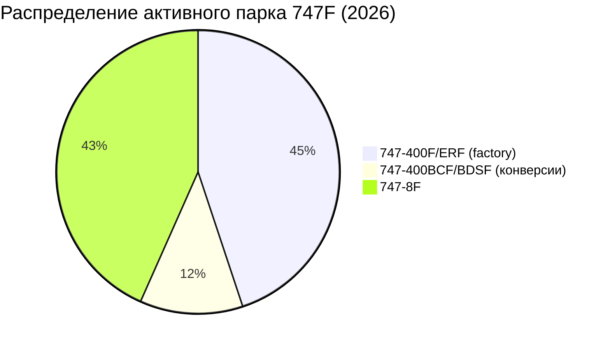
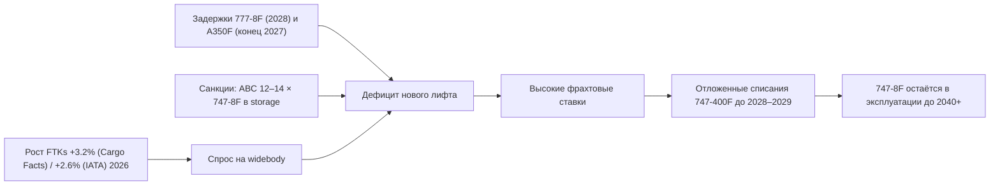
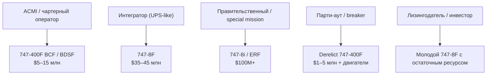

# Анализ вторичного рынка Boeing 747F

> Внутренний документ Sinoptics · Версия 1.0 · Май 2026  
> Фокус: вторичный рынок грузовых Boeing 747-400F / 747-8F и конверсий PAX→F

---

## 1. Резюме (TL;DR)

- Производство Boeing 747 завершено в январе 2023 года (последний 747-8F передан Atlas Air).
- Активный парк: ~135–150 ед. 747-400F/ERF + ~38 ед. конверсий BCF/BDSF + ~140 ед. 747-8F.
- Ценовой диапазон на вторичном рынке (2026): $10–20 млн за старые 747-400F, до $45–47 млн за молодые экземпляры; 747-8F — $35–45 млн (отдельные сделки до $135 млн).
- Рынок продавца: задержки программ 777-8F (2028) и A350F (конец 2027) + санкционные ограничения на российские активы создают дефицит лифта.
- Для российских покупателей западные борта практически недоступны без OFAC-лицензии; парк AirBridgeCargo (12–14 × 747-8F) находится в storage в Шереметьево с 2022 года.

---

## 2. Варианты 747F и их статус

| Вариант | Тип | Поставлено | Средний возраст (2026) | Ключевые особенности | Статус на рынке |
|---------|-----|------------|------------------------|----------------------|-----------------|
| **747-400F** | Заводской грузовой | 126 | ~33 года | Носовая загрузка, 113 т payload | Основной объём вторичного рынка |
| **747-400ERF** | Заводской ER | 40 | ~20–22 года | Увеличенная MTOW, дальность | Премиум-сегмент 400-й серии |
| **747-400BCF** | Boeing-конверсия PAX→F | ~50 | ~30+ лет | Конверсия 2005–2015 гг. | Дешевле factory, ограниченный ресурс |
| **747-400BDSF** | IAI Bedek-конверсия | 29 | ~30+ лет | Альтернативная конверсия | Ниже цены BCF |
| **747-8F** | Заводской (последняя серия) | 107 | ~8–14 лет | +20% payload, –16% расход топлива | Самый молодой и дорогой сегмент |

**УТП 747F:** носовая грузовая дверь (nose cargo door) позволяет загружать негабаритные грузы, которые не проходят через боковую дверь 777F / A350F. Это сохраняет спрос на 747-8F даже после появления более экономичных twinjet-фрахтов.

---

## 3. Размер активного парка 2026

- **747-400F + ERF (factory):** 135–150 ед. в коммерческой эксплуатации [1][3]
- **747-400BCF / BDSF:** ~38 ед. активны (из 79 конверсий) [4]
- **747-8F:** ~140 ед. (самый молодой парк, производство завершено в 2023) [2]

---

## 4. Ключевые операторы и владельцы парка

| Оператор | 747-400F/ERF | 747-8F | Регион | Примечание |
|----------|--------------|--------|--------|------------|
| **Atlas Air** | 24–26 | 17 | Северная Америка | Крупнейший оператор 747 в мире |
| **UPS Airlines** | 13 | 30 | Северная Америка | Крупнейший флот 747-8F |
| **Cargolux** | 14–16 | 14 | Европа | Переход на 8F |
| **Kalitta Air** | 22 | — | Северная Америка | Чартеры, госконтракты |
| **Polar Air Cargo** | 8–10 | — | Северная Америка | Транстихоокеанские рейсы |
| **Lufthansa Cargo** | 5–7 | — | Европа | Сокращение парка |
| **Cathay Pacific Cargo** | ~6 | 14 | Азия | — |
| **Korean Air Cargo** | — | ~10 | Азия | — |
| **Silk Way West** | 3–5 | — | Ближний Восток | Хаб Баку |
| **AirBridgeCargo** | — | 12–14 (storage) | Россия | Приостановлены с 2022 [8] |

---

## 5. Ценовая ситуация на вторичном рынке (2026)

| Сегмент | Диапазон цены | Примеры / комментарии |
|---------|---------------|-----------------------|
| 747-400F (старые, высокие часы/циклы) | $10–20 млн | Часто требуют капитального ремонта |
| 747-400F (молодые, FSCD) | до $45–47 млн | OE-IFM (ASL Belgium) — $47.51 млн; N782CK (Kalitta) — $45.88 млн [1] |
| 747-400BCF / BDSF | $5–15 млн | Ниже factory-вариантов |
| 747-8F (стандарт) | $35–45 млн | Хорошее состояние, недавний overhaul |
| 747-8 (премиум / VIP / government) | до $135 млн | SNC приобрела 5 × 747-8i у Korean Air по $135 млн за борт для SAOC-программы [5] |
| Lease rate (747-400) | $100K+ / мес. | Без MRO |
| Демонтаж / parting-out | $1–5 млн (airframe) + двигатели | До 85% компонентов на вторичном рынке [6] |

**Примечание:** реальные транзакции редко публикуются; указанные цифры — рыночные оценки ch-aviation / Collateral Verifications LLC и отраслевые публикации.

---

## 6. Драйверы спроса и предложения

Ключевые драйверы спроса: e-commerce, semiconductors, AI-hardware, фармацевтика, негабаритные грузы (аэрокосмические компоненты, военная техника).

---

## 7. Каналы продаж и брокеры

| Тип | Площадки / компании | Комментарий |
|-----|---------------------|-------------|
| **Маркетплейсы** | Wingslist, GlobalPlaneSearch, AvPay, IBA, AirNav | Регулярные листинги 747F |
| **Специализированные брокеры** | ACC Aviation (747-специализация), McLarens Aviation (32 офиса), Logistic Air, Industrial Marine Power | Полный цикл сделки |
| **Лессоры** | BOC Aviation, AerCap, Air Lease Corp, SMBC | Возврат из лизинга |
| **OEM** | Boeing | Недоступен (производство закрыто) |
| **Прямые сделки** | Atlas Air, UPS, SNC, Korean Air | Примеры: SNC × Korean Air (5 × 747-8i) |

---

## 8. Российский контекст и санкции

**AirBridgeCargo (Volga-Dnepr Group):** 12–14 Boeing 747-8F находятся в storage в Шереметьево с марта 2022 года [8][9].

**Санкционный статус:**
- Аппараты включены в списки BIS / OFAC.
- Любое перемещение, техобслуживание или продажа требует экспортной лицензии США.
- Кейс BOC Aviation vs Volga-Dnepr: американский суд присудил более $400 млн за три 747-8F; один борт возвращён (VQ-BFE → OE-LFI, Air Belgium) [10].

**План EAS Group (Evgeny Solodilin) на Q1 2026:** возврат 9 × 747-8F международным лессорам, урегулирование долга ~$500 млн. Реализация зависит от получения OFAC-лицензий [11][12].

**Вывод для российских покупателей:** вторичный рынок западных 747F закрыт санкциями. Приобретение возможно только через лицензированный механизм возврата/выкупа с участием не-санкционных сторон и одобрения регуляторов.

---

## 9. Чек-лист due diligence перед покупкой

1. **Идентификация:** MSN, регистрация, история ownership.
2. **Лётно-технические данные:** TSN / CSN (hours / cycles), engine status (Green-time / TBO remaining).
3. **Техническое обслуживание:** даты C-check / D-check, compliance с AD / SB.
4. **Конструктивное состояние:** коррозия (критично для 30+ летних бортов), fatigue, back-to-birth records.
5. **Юридический статус:** liens, mortgages, lease termination, sanctions screening контрагента.
6. **Для конверсий:** сертификат конверсии (Boeing / IAI), payload / volume после конверсии.
7. **Финансы:** lease vs purchase, escrow, source of funds, insurance history.

---

## 10. Карта «потребность → оптимальный вариант»

---

## 11. Прогноз 2026–2035

- **747-400F:** списания ускорятся после 2028 года; парк сократится до ~50–60 ед. к 2030.
- **747-8F:** останется в эксплуатации до 2040+; нет прямого преемника по носовой загрузке и объёму.
- **Замещение:** 777-8F (с 2028), A350F (конец 2027), 777-300ERSF (IAI-конверсия).
- **Цены 747-8F:** устойчивы или растут из-за структурного дефицита лифта.

---

## 12. Риски и ограничения

- **Регуляторные:** ICAO CORSIA, EU ReFuelEU SAF mandates, шумовые ограничения Stage 5.
- **Технические:** рост стоимости поддержания стареющего парка 747-400F.
- **Финансовые:** ликвидность ниже, чем у 777F; остаточная стоимость зависит от геополитики.
- **Геополитические:** санкции, экспортный контроль, риск вторичных санкций при сделках с российскими активами.

---

*Следующий документ: [sources.md](./sources.md)*