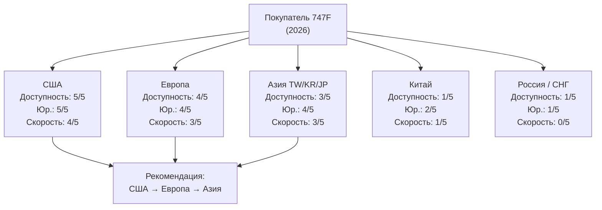
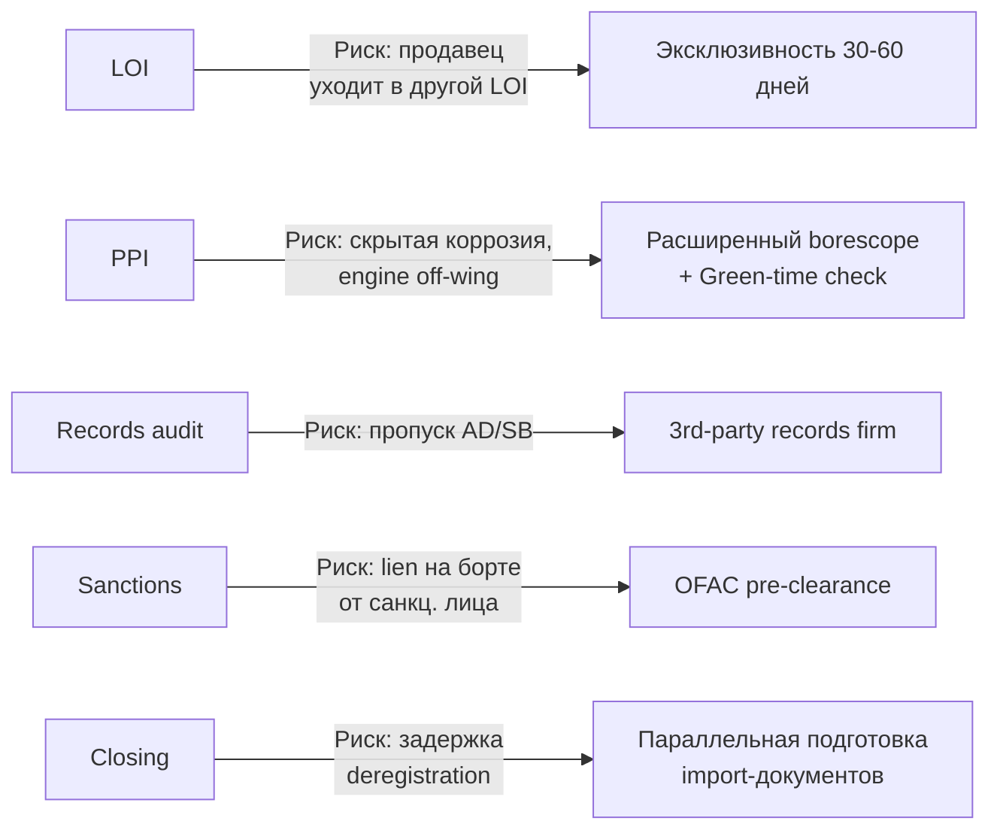
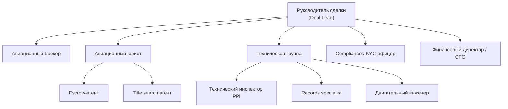

# Где купить Boeing 747F: места, китайский трек и дорожная карта сделки

> Внутренний документ Sinoptics · Версия 1.0 · Май 2026  
> Дополнение к [01-market-analysis-747f-ru.md](./01-market-analysis-747f-ru.md)

---

## 1. Вводная карта вероятности — скоринг по регионам

Оценка по 4 осям: **доступность борта** (предложение на рынке), **юридическая чистота** (records, title), **скорость сделки**, **санкционный риск** (для нероссийского / для российского покупателя соответственно).

| Регион | Доступность | Юр. чистота | Скорость | Санкц. риск (не-РФ / РФ) | Итог |
|--------|------------|------------|----------|-------------------------|------|
| **США** | Очень высокая | Очень высокая (FAA records) | Высокая (3–6 мес.) | Низкий / Очень высокий | **#1 для не-РФ** |
| **Европа (LU, DE, IS, UK)** | Высокая | Высокая | Средняя (4–7 мес.) | Низкий / Высокий | **#2** |
| **Азия (TW, KR, JP)** | Средняя | Высокая | Средняя (5–8 мес.) | Средний / Высокий | **#3** |
| **Китай (CN)** | Низкая (3–4 ед.) | Средняя (CAAC) | Низкая (8–14 мес.) | Низкий / Средний (тариф. неопр.) | **#4** |
| **Россия / СНГ** | Только Silk Way West (3–5 ед.); ABC — в storage | Низкая (sanctions liens) | Очень низкая | Очень высокий / н/п | **Заблокировано** |

---

## 2. Наиболее вероятные места покупки 747F — по регионам

### 2.1. США — #1 для большинства покупателей

**Парк и потенциальные продавцы:**
- **Atlas Air:** 24–26 × 747-400F + 17 × 747-8F — крупнейший оператор; периодически ремаркетит флот через Titan Aviation [1]
- **UPS Airlines:** 13 × 400F + 30 × 8F — но 8F критичны до 2040+, продажа маловероятна
- **Kalitta Air:** 22 × 400F — активный участник ACMI/чартеров; продажи единичны
- **Polar Air Cargo (Atlas):** 8–10 × 400F — Atlas-аффилирован
- **National Airlines:** 4–6 × 400F

**Брокеры с головным офисом в США:**
- **AerSale** (Coral Gables, FL) — Air India 747-400 → конверсия / parting-out [2]
- **Jetran** (Texas) — дилер для Asiana 747-400 lease [3]
- **GA Telesis** (Fort Lauderdale, FL) — крупный aftermarket
- **Logistic Air** (Calif.) — листинги 747 на Wingslist [4]

**Платформы:** Wingslist, GlobalPlaneSearch, AvPay, IBA Insight, ch-aviation.

**Преимущества США как площадки:**
- FAA Civil Aviation Registry (Oklahoma City) — централизованный title search, lien search
- Escrow-агенты с opaccity titles (Aerospace Reports, Insured Aircraft Title Service)
- Полные back-to-birth records, AD/SB compliance документация
- Концентрация MRO-баз (Marana, Greenwood, Oscoda) для PPI и ferry-flight подготовки

**Риски для российского покупателя:**
- **OFAC** Office of Foreign Assets Control — обязательная проверка End-User / End-Use
- **EAR** Export Administration Regulations + **ITAR** для отдельных компонентов
- **CISADA / CAATSA** — вторичные санкции при работе с любым российским связанным лицом
- Без OFAC general или specific license сделка фактически невозможна

### 2.2. Европа — #2

**Парк и потенциальные продавцы:**
- **Cargolux** (Люксембург): 14–16 × 400F + 14 × 8F — постепенный переход на 8F, частичная продажа 400F ожидается [5]
- **Lufthansa Cargo** (Германия): 5–7 × 400F — фаза-аут в пользу 777F
- **Air Atlanta Icelandic** (Исландия): купила 3 × China Airlines 747-400F в 2024 за ~$83 млн (с убытком $30 млн против рыночной оценки) [6]; часть парка может перепродаваться
- **ASL Airlines Belgium** (Бельгия): 5 × 400F, в т.ч. OE-IFM ($47.51 млн market value) [7]
- **Air Belgium** (OE-LFI, бывш. VQ-BFE) — recovery от BOC Aviation после кейса с Volga-Dnepr

**Брокеры:**
- **ACC Aviation** (UK) — головной офис в Лондоне, 60+ специалистов, 5 офисов; 747-специализация [8]
- **McLarens Aviation** (UK) — 32 офиса, ремаркетинг с 1940-х [9]
- **IBA Group** (UK) — оценка и брокеридж
- **Aircraft Management Services (AMS)** (London) — продавала 5 × China Airlines 747-400F [10]

**Преимущества Европы:**
- EASA records, прозрачная регуляторика
- Нейтральные юрисдикции (Люксембург, Ирландия) для сделок с восточными покупателями
- Развитая лизинговая инфраструктура (Дублин)

**Риски:**
- EU sanctions package 8+ — широкие ограничения на любые услуги для лиц с РФ-связью
- AOC issues при peremene операторов внутри ЕС
- Цены в Европе часто на 5–10% выше США из-за дефицита 8F в Европе

### 2.3. Азия (Тайвань, Корея, Япония) — #3

- **China Airlines** (Тайвань, CI): продала 5 × 747-400F через AMS в 2023–2024 (2 → Asiana за $55 млн; 3 → Air Atlanta за $83 млн) [6][10]; остаток парка ~5 ед., замена на 777F продолжается
- **Asiana / AirZeta** (Корея): после Korean–Asiana merger AirZeta (бывш. Air Incheon) приняла 11 × Asiana 747-400F в августе 2025 (3 × BDSF + 5 × FSCD + остальные); часть может быть избыточной [11]
- **Korean Air Cargo** (Корея): 4 × 747-400ERF + 7 × 747-8F + 12 × 777F — не продаёт активно
- **Nippon Cargo Airlines (NCA)** (Япония): последняя поставка 747-400F в 2009; парк сокращается, возможен parting-out
- **Cathay Pacific Cargo** (HK): 6 × 400F + 14 × 8F — постепенный вывод 400-х

**Брокеры в Азии:**
- **ACC Aviation Asia** (Hong Kong / Singapore)
- **Industrial Marine Power** (буферный брокер Юж. Кореи) — публично искал 747-400F 2007 build для корейского клиента в марте 2026 [12]

### 2.4. Россия и СНГ — заблокировано / ограничено

- **AirBridgeCargo** (Россия): 12–14 × 747-8F в storage в Шереметьево с марта 2022; sanctions (BIS / OFAC), требуется лицензия; план EAS возвращать 9 ед. лессорам в Q1 2026 [13]
- **Silk Way West** (Азербайджан): 3–5 × 400F; нейтральная юрисдикция, но рынок узкий, продажи редки
- **Aerotranscargo** (Молдова): 1 × 400F
- **Terra Avia** (Молдова): 1 × 400F

---

## 3. Отдельный блок: Китай — анализ вероятности покупки

### 3.1. Китайские операторы с парком 747F (2026)

| Оператор | Тип | Кол-во | Статус и тренд |
|----------|-----|--------|----------------|
| **Air China Cargo** | 747-400F | 3 | Постепенный вывод; заказ 10 × A350F (поставки 2029–2031), promo SAF [14] |
| **Suparna Airlines** (бывш. Yangtze River) | 747-400F / BDSF / ERF | 1 остаток | Активное списание: B-2432 (2025), B-2435 (2025), B-1340 (2026), B-2437 (последний, 2026) → замена на 8 × B777F [15] |
| **China Cargo Airlines** | — | 0 (нет 747) | Полностью на 777F |
| **China Postal Airlines** | — | 0 | 777F |
| **Central Airlines** | — | 0 | 777F |
| **China Southern Air Cargo** | — | 0 | 777F |
| **Air China (mainline)** | 747-400/8I (PAX/VIP) | 3 + 6 | VIP и государственные чартеры; не на продажу |

**Вывод:** мейнленд-китайский 747F парк практически закрылся в 2025–2026. Свободных бортов почти нет — Suparna в 2025–2026 уже вывела 4 шт., и они, вероятно, отправились на parting-out, а не на дальнейшую коммерческую жизнь (возраст 28–34 года). Air China Cargo пока удерживает 3 ед.

### 3.2. Возможность покупки 747F в Китае: регуляторная карта

- **CAAC** (Civil Aviation Administration of China): для вывоза б/у воздушного судна из КНР иностранным покупателем требуется **Export Certificate of Airworthiness**, выдаваемый CAAC, на основании **FAA–CAAC BASA / Implementation Procedures for Airworthiness (IPA)** [16].
- **Экспортный контроль КНР (с 01.12.2024):** «Regulations of the PRC on Export Control of Dual-Use Items» — воздушные суда и компоненты могут классифицироваться как dual-use; экспортёр обязан подать заявку и получить лицензию **MOFCOM** [17].
- **CCAR-201** (Foreign Investment in Civil Aviation): ограничения на иностранные инвестиции и операционные права; покупка борта формально допустима, но эксплуатация в Китае требует AOC, который иностранцу не выдадут [18].
- **Геополитический контекст 2026:** в апреле 2025 Китай заблокировал поставки Boeing в ответ на тарифы; в мае 2026 — landmark deal на 200 новых Boeing для Air China / China Eastern / China Southern. Но **это новые борта, не вторичный рынок 747F** [19].
- **Tariff war residue:** остаточная регуляторная неопределённость, возможны задержки в оформлении документов и непредсказуемые проверки.

### 3.3. Итоговая оценка вероятности покупки в Китае

| Параметр | Оценка | Комментарий |
|----------|--------|-------------|
| Доступность борта | **Низкая** | Suparna вывела последние 747F; Air China Cargo 3 ед. — не на продажу |
| Юридическая сложность | **Высокая** | CAAC Export CoA + MOFCOM dual-use + CCAR-201 + BASA IPA |
| Санкционный риск (для не-РФ) | Низкий | Китай — нейтральная юрисдикция |
| Санкционный риск (для РФ) | **Средний–высокий** | Тарифная война и риск вторичных санкций США |
| Скорость сделки | **Медленная** | Бюрократия CAAC + MOFCOM: 8–14 месяцев |
| Гарантия records | Средняя | CAAC не предоставляет публичный registry уровня FAA |
| **Итоговая вероятность** | **Низкая** | Технически возможно, но 747F в КНР — исчезающий ресурс; ехать стоит только под конкретный известный борт |

**Рекомендация:** не рассматривать Китай как приоритетный рынок поиска 747F. Если интерес — конкретный борт Air China Cargo или последний Suparna, действовать через **ACC Aviation Hong Kong** или прямой контакт с правлением оператора, с готовностью к 8–14 месяцам цикла.

---

## 4. Скоринг-матрица регионов (визуально)

---

## 5. Дорожная карта сделки (Roadmap)

Типовой цикл от мандата брокера до коммерческой эксплуатации 747-400F на вторичном рынке.

### 5.1. Gantt-диаграмма

```mermaid
gantt
    title Покупка 747-400F: типовой таймлайн (месяцы)
    dateFormat  X
    axisFormat  M%d
    section Поиск
    Мандат брокера + NDA           :a1, 0, 1
    Лонг-лист (3-7 кандидатов)     :a2, 0, 2
    Шорт-лист + первичный screen   :a3, 1, 2
    section Сделка
    LOI + deposit (1-5%)           :b1, 2, 1
    Pre-purchase inspection (PPI)  :b2, 2, 1
    Records audit (back-to-birth)  :b3, 2, 1
    Sanctions / OFAC screening     :b4, 3, 1
    Purchase Agreement / SPA       :b5, 3, 1
    Title search + escrow setup    :b6, 3, 1
    Closing (wire + dereg + reg)   :b7, 4, 1
    section Передача
    Ferry permit + ferry flight    :c1, 4, 1
    AOC type add (если нужно)      :c2, 5, 1
    Первый A-check + MRO setup     :c3, 5, 1
    Коммерческий ввод              :c4, 6, 1
```

### 5.2. Этапы и сроки (детально)

| Месяц | Этап | Действия и документы |
|-------|------|----------------------|
| **0** | Мандат брокера | Выбор брокера (ACC Aviation / McLarens / AerSale), NDA, RFP (вариант, возраст, бюджет, регион базирования) |
| **0–1** | Лонг-лист | Брокер даёт 3–7 кандидатов: MSN, TSN/CSN, engine status, заявленная цена; market value report |
| **1–2** | Шорт-лист и LOI | Letter of Intent с deposit 1–5% от цены; согласование цены, базиса передачи (full-life / half-life), сроков |
| **2–3** | PPI (Pre-Purchase Inspection) | Выезд технической команды (5–10 дней на месте): inspection двигателей, fuselage, landing gear, avionics; borescope; flight test |
| **2–3** | Records audit | Records specialist: back-to-birth records, AD / SB compliance, C/D-check history, repair history, mod summary |
| **3** | Sanctions screening | OFAC / EU / UK / OFSI checks для продавца, лессора, прошлых владельцев; KYC контрагентов; lien search |
| **3–4** | SPA + escrow | Покупно-продажный контракт (обычно по форме IATA / ABS); escrow account (Aerospace Reports или аналог); title search в FAA Oklahoma City Registry [20] |
| **4** | Closing | Wire transfer → escrow release → Bill of Sale (FAA 8050-2 для US-borts) → deregistration (страна продавца) → import / registration (страна покупателя) |
| **4–5** | Ferry flight | Ferry permit (CAA / FAA), страховка ferry, экипаж (часто от брокера или MRO); перегон до домашней базы |
| **5–6** | AOC add + MRO setup | Добавление типа в AOC покупателя (если не было); первый A-check; договор с MRO (например, Mubadala, ST Aerospace, Lufthansa Technik) |
| **6+** | Коммерческий ввод | Первый коммерческий полёт |

**Итого:**
- Стандартная сделка (US → не-санкц. покупатель): **5–7 месяцев**
- Сложная сделка (через нейтральную юрисдикцию, не-US records): **8–12 месяцев**
- Сделка с конверсией PAX→F: **+12–18 месяцев на конверсию** (через Boeing/IAI Bedek)
- Сделка с российским буферным звеном (Silk Way / нейтральные SPV): **12–18 месяцев + OFAC license risk**

### 5.3. Ключевые риски на каждом этапе

---

## 6. Чек-лист первых шагов (если стартовать прямо сейчас)

1. **Сформировать RFP** — внутренний документ с параметрами: вариант (400F / 8F / BCF), max возраст, max TSN/CSN, бюджет, регион базирования, требуемый AOC.
2. **Открыть 2–3 параллельных мандата** у брокеров для конкуренции:
   - **ACC Aviation** — глобальный охват, 747-специализация (https://accaviation.com)
   - **McLarens Aviation** — европейский ремаркетинг (https://www.mclarens.com)
   - **AerSale** — США + parting-out альтернатива
3. **Подписаться на платформы листингов:**
   - **Wingslist** Commercial Listings — еженедельные апдейты
   - **GlobalPlaneSearch** — Cargo/Freighter секция
   - **AvPay** — Boeing 747 marketplace
   - **ch-aviation Pro** — fleet & market value (платная подписка)
4. **Запросить market value report у IBA** или **Collateral Verifications LLC** — для понимания справедливой цены конкретных MSN.
5. **Заранее выбрать escrow-агента** (Aerospace Reports, Insured Aircraft Title Service) и **юриста по авиасделкам** (Holland & Knight, Pillsbury, K&L Gates).
6. **Подготовить compliance-документы:** KYC покупающего юрлица, источник средств, sanctions self-declaration, end-user statement.
7. **Сформировать техническую команду PPI:** инспектор (часто от MRO с 747-опытом — Lufthansa Technik / ST Aerospace), records specialist, engine borescope-инженер.

---

## 7. Команда сделки: кто нужен для покупки 747F

Покупка крупного воздушного судна на вторичном рынке — это командная работа. Минимальный состав deal team и зоны ответственности каждого участника.

### 7.1. Состав команды

### 7.2. Роли, функции и конкретные кандидаты

| Роль | Функции | Кандидаты (примеры) | Стоимость |
|------|---------|---------------------|-----------|
| **Руководитель сделки (Deal Lead)** | Координация всех участников, таймлайн, решения по переговорам | Внутренний менеджер проекта или брокер в роли lead advisor | — |
| **Авиационный брокер** | Поиск борта, листинги, переговоры по цене, LOI | ACC Aviation, McLarens Aviation, AerSale, Jetran | 1–3% от цены (обычно комиссия со стороны продавца) |
| **Авиационный юрист** | SPA, warranties, closing, title transfer, escrow instructions, export/import permits | Holland & Knight, Pillsbury Winthrop, K&L Gates, Watson Farley & Williams | $50–150K за сделку |
| **Технический инспектор (PPI)** | Pre-Purchase Inspection (5–10 дней): fuselage, landing gear, avionics, nose door, interior | Lufthansa Technik, ST Aerospace, Mubadala MRO, HAECO | $15–30K за инспекцию |
| **Records specialist** | Back-to-birth records, AD/SB compliance, C/D-check history, repair orders, mod summary | BBA Aviation, JSSI, независимые 747-records консультанты | $10–20K |
| **Двигательный инженер** | Borescope двигателей, оценка TSN/CSN/EGT, Green-time расчёт, engine run-up | Engine specialists при MRO или независимые (напр. MTECH) | $5–10K |
| **Compliance / KYC-офицер** | OFAC/EU/UK screening продавца, лессора, истории борта; sanctions self-declaration; EUC | Внутренний compliance или внешний KYC-провайдер (Kharon, World-Check) | $5–15K |
| **Escrow-агент** | Удержание и высвобождение денег при closing; escrow instructions | Aerospace Reports (ARI), Insured Aircraft Title Service (IATS) | $3–10K |
| **Title search агент** | FAA Civil Aviation Registry: liens, encumbrances, ownership history | Insured Aircraft Title Service (IATS), Aviation Title Consulting | $1–3K |
| **MRO-партнёр** | Первый A-check после delivery, долгосрочная программа техобслуживания | Lufthansa Technik, ST Engineering, Mubadala, Haite Aviation | Долгосрочный контракт |
| **Страховой брокер** | Hull & liability insurance, ferry insurance | Marsh Aviation, Aon Aviation, Willis Towers Watson | 0.1–0.3% от hull value/год |

### 7.3. RACI-матрица по этапам сделки

| Этап | Deal Lead | Брокер | Юрист | Тех. группа | Compliance | CFO |
|------|-----------|--------|-------|-------------|------------|-----|
| RFP / мандат | **R** | A | — | — | — | I |
| Лонг-лист / шорт-лист | I | **R** | — | C | — | I |
| LOI + deposit | **R** | A | C | — | I | A |
| PPI + records audit | I | I | — | **R** | — | I |
| Sanctions screening | C | — | C | — | **R** | — |
| SPA + escrow setup | A | I | **R** | — | C | A |
| Closing | A | I | **R** | — | C | **R** |
| Ferry flight | I | — | C | **R** | — | — |
| AOC + MRO setup | I | — | C | **R** | — | I |

*R = Responsible (исполняет), A = Accountable (отвечает), C = Consulted (консультирует), I = Informed (информируется)*

### 7.4. Минимальная команда для первой сделки

Если бюджет ограничен и это первая покупка крупного воздушного судна, минимально необходимый состав:

1. **Ведущий брокер с 747-опытом** — заменяет Deal Lead на начальном этапе (ACC Aviation или McLarens)
2. **Авиационный юрист** — обязателен для SPA и closing
3. **Независимый технический инспектор PPI** — нельзя полагаться на inspection брокера продавца
4. **Records specialist** — критично для 30+ летних бортов с неполной историей
5. **Escrow-агент / title search** — стандартная практика для US-registered aircraft

Минимальный бюджет на профессиональные услуги команды (без стоимости борта): **$80–170K.**

---

## Источники

Все ссылки и нумерация — см. [sources.md](./sources.md). В этом документе использованы источники [1]–[20] (новые источники по разделу будут добавлены в общий `sources.md` при следующем апдейте).

---

*Связанные документы: [01-market-analysis-747f-ru.md](./01-market-analysis-747f-ru.md) · [sources.md](./sources.md)*