# Каталог продукции и иллюстраций

Объединённый каталог по материалам двух производственных баз **без указания наименований заводов**.

Источники (внутр.): [20260406-yuhuan-tianrun/content-ru.md](20260406-yuhuan-tianrun/content-ru.md) | [qifeng-2022/content-ru.md](qifeng-2022/content-ru.md)

Сводка возможностей: [capabilities-ru.md](capabilities-ru.md)

---

## Раздел A. Системы запирания и авиационные механизмы

### A.1 Профиль и компетенции

#### A.1.1 Комплектация ВВС и гражданской авиации

Комплектация для военной и гражданской авиации — предприятие, построенное на принципах сертификации летной годности.

#### A.1.2 Профиль предприятия

Специализация: системы запирания кабины вертолётов, eVTOL и БПЛА; механизмы быстрой установки и снятия. *Текст на слайде частично искажён OCR — см. изображение.*

#### A.1.3 Ключевые показатели

- Национальный «маленький гигант» (专精特新)
- Замковая продукция — более 85% объёма
- НИОКР и опытное производство — более 8%
- 8 продуктов уровня «первая партия» (首台套) провинции/города

#### A.1.4 История развития

1999 — основание; 2003–2007 — авиационная комплектация; 2012 — «четыре сертификата»; 2015–2017 — завод 20 000 м²; 2019–2025 — AS9100, CNAS, «маленький гигант»; 2026 — гражданские крупные самолёты, eVTOL, PMA, статус QSL у OEM.

#### A.1.5 НИОКР и производство

11 инженеров НИОКР, 14 технологов; 63 патента; портальный ЦО до 6000×2000 (0,01 мм); 5-осевой ЦО до 3000×2000 (0,006 мм).

#### A.1.6 Летная годность

Разработка механизмов запирания дверей кабины для AC313, AC311A, AC313A, GA20; сертификация летной годности завершена.

---

### A.2 Быстросъёмные и запирающие системы

#### A.2.1 Типовая линейка (обзор 1)

**Категории слайда:** быстросъёмные замки · запирающие системы · наземное оборудование (GSE)

*На слайде указаны только артикулы под миниатюрами; отдельные торговые наименования не приведены.*

##### Серия HB2 (авиастандарт HB)

| № | Артикул | Миниатюра | Наименование / тип | Примечание |
|---|---------|-----------|-------------------|------------|
| 1 | HB2-12-2002 | 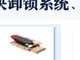 | Замок/защёлка HB2 | toggle-тип |
| 2 | HB2-13-94 | 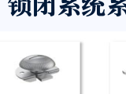 | Замок/защёлка HB2 | — |
| 3 | HB2-32-2004 | 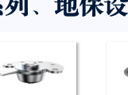 | Замок/защёлка HB2 | — |
| 4 | HB2-33-94 | 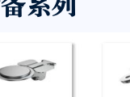 | Замок/защёлка HB2 | — |
| 5 | HB2-36-94 | 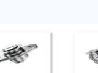 | Замок/защёлка HB2 | — |
| 6 | HB2-37-94 | 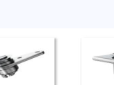 | Замок/защёлка HB2 | — |
| 7 | HB2-40-94 | 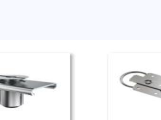 | Замок/защёлка HB2 | — |
| 8 | HB2-42-94 | 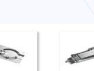 | Замок/защёлка HB2 | — |
| 9 | HB2-43-94 |  | Замок/защёлка HB2 | — |
| 10 | HB2-44-94 | 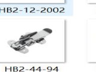 | Замок/защёлка HB2 | — |
| 11 | HB2-45-94 | 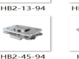 | Замок/защёлка HB2 | — |
| 12 | HB2-71-94 | 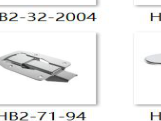 | Замок/защёлка HB2 | — |
| 13 | HB2-72-94 | 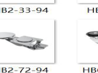 | Замок/защёлка HB2 | — |

##### Серии HB6539–HB8231 (авиастандарт HB)

| № | Артикул | Миниатюра | Наименование / тип | Примечание |
|---|---------|-----------|-------------------|------------|
| 14 | HB6539-1.6F | 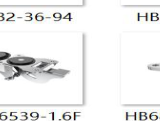 | Крепёж/замок HB | стандартизированный авиационный компонент |
| 15 | HB6864-2011 | 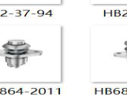 | Крепёж/замок HB | — |
| 16 | HB6865-2011 | 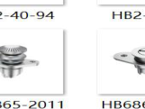 | Крепёж/замок HB | — |
| 17 | HB6866-2008 | 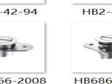 | Крепёж/замок HB | — |
| 18 | HB6867-2008 | 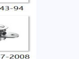 | Крепёж/замок HB | — |
| 19 | HB6980-94 | 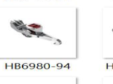 | Крепёж/замок HB | — |
| 20 | HB7182-1995 | 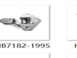 | Крепёж/замок HB | — |
| 21 | HB7464-96 | 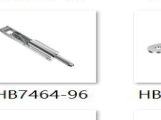 | Крепёж/замок HB | — |
| 22 | HB8073-2002 | 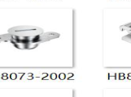 | Крепёж/замок HB | — |
| 23 | HB8231-2002 | 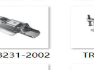 | Крепёж/замок HB | — |

##### Серия TR-K101 (быстросъёмный замок)

| № | Артикул | Миниатюра | Наименование / тип | Примечание |
|---|---------|-----------|-------------------|------------|
| 24 | TR-K101A | 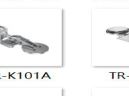 | Быстросъёмный замок, серия K101 | cam/compression-тип |
| 25 | TR-K101B | 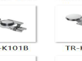 | Быстросъёмный замок, серия K101 | — |
| 26 | TR-K101C | 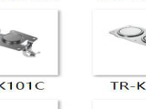 | Быстросъёмный замок, серия K101 | — |
| 27 | TR-K101D | 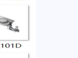 | Быстросъёмный замок, серия K101 | — |
| 28 | TR-K101E | 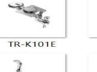 | Быстросъёмный замок, серия K101 | — |
| 29 | TR-K101F | 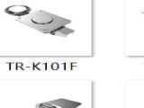 | Быстросъёмный замок, серия K101 | — |
| 30 | TR-K101G | 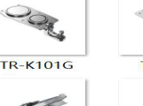 | Быстросъёмный замок, серия K101 | — |
| 31 | TR-K101I | 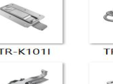 | Быстросъёмный замок, серия K101 | — |

##### Серия TR-K201

| № | Артикул | Миниатюра | Наименование / тип | Примечание |
|---|---------|-----------|-------------------|------------|
| 32 | TR-K201A | 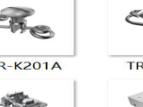 | Быстросъёмный замок, серия K201 | — |
| 33 | TR-K201B | 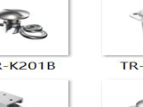 | Быстросъёмный замок, серия K201 | — |

##### Серия TR-K301

| № | Артикул | Миниатюра | Наименование / тип | Примечание |
|---|---------|-----------|-------------------|------------|
| 34 | TR-K301A | 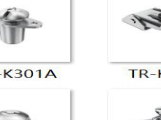 | Быстросъёмный замок, серия K301 | — |

##### Серия TR-K401

| № | Артикул | Миниатюра | Наименование / тип | Примечание |
|---|---------|-----------|-------------------|------------|
| 35 | TR-K401A | 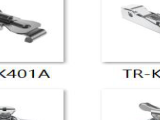 | Быстросъёмный замок, серия K401 | toggle-тип |
| 36 | TR-K401B | 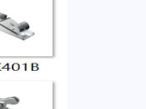 | Быстросъёмный замок, серия K401 | — |
| 37 | TR-K401C | 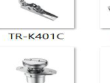 | Быстросъёмный замок, серия K401 | — |
| 38 | TR-K401D | 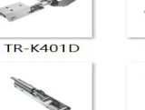 | Быстросъёмный замок, серия K401 | — |
| 39 | TR-K401E | 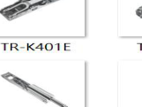 | Быстросъёмный замок, серия K401 | — |
| 40 | TR-K401F | 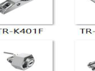 | Быстросъёмный замок, серия K401 | — |
| 41 | TR-K401F-SZ | 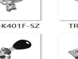 | Быстросъёмный замок, серия K401 | модификация F-SZ |
| 42 | TR-K401G | 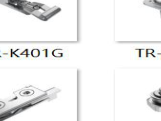 | Быстросъёмный замок, серия K401 | — |

##### Серия TR-K501

| № | Артикул | Миниатюра | Наименование / тип | Примечание |
|---|---------|-----------|-------------------|------------|
| 43 | TR-K501A | 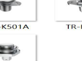 | Быстросъёмный замок, серия K501 | — |
| 44 | TR-K501B | 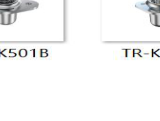 | Быстросъёмный замок, серия K501 | — |
| 45 | TR-K501C | 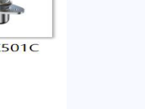 | Быстросъёмный замок, серия K501 | — |
| 46 | TR-K501D | 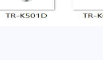 | Быстросъёмный замок, серия K501 | — |

##### Серии TR-K601, TR-K701, TR-K801/K802

| № | Артикул | Миниатюра | Наименование / тип | Примечание |
|---|---------|-----------|-------------------|------------|
| 47 | TR-K601A | 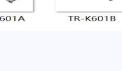 | Быстросъёмный замок, серия K601 | тяжёлый крепёж |
| 48 | TR-K601B | 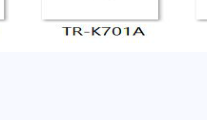 | Быстросъёмный замок, серия K601 | — |
| 49 | TR-K701A | 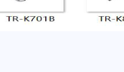 | Быстросъёмный замок, серия K701 | — |
| 50 | TR-K701B | 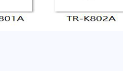 | Быстросъёмный замок, серия K701 | — |
| 51 | TR-K801A |  | Быстросъёмный замок, серия K801 | — |
| 52 | TR-K802A |  | Быстросъёмный замок, серия K802 | — |

**Итого на слайде 10: 52 позиции**

#### A.2.2 Типовая линейка (обзор 2)

**Категории слайда:** тросовые комплекты · запирающие/механические узлы · рукоятки управления · наземное оборудование (GSE)

*На слайде указаны только артикулы; наименование — по типу изделия и визуальной идентификации.*

##### Серия TR-C (тросовые и монтажные комплекты)

| № | Артикул | Миниатюра | Наименование / тип | Примечание |
|---|---------|-----------|-------------------|------------|
| 1 | TR-C101A | 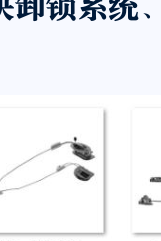 | Тросовый комплект с замковыми узлами | двухточечное крепление |
| 2 | TR-C103A |  | Тросовый комплект с замковыми узлами | — |
| 3 | TR-C201A |  | Комплект монтажных пластин | 4 пластины в комплекте |
| 4 | TR-C202A |  | Комплект монтажных пластин | — |
| 5 | TR-C301A |  | Тонкий трос/тяга с наконечниками | — |
| 6 | TR-C401A |  | Тросовый комплект, многоточечное крепление | — |
| 7 | TR-C501A |  | Блок/корпус крепления (2 шт.) | — |
| 8 | TR-C601A |  | Длинная тяга с несколькими точками крепления | — |
| 9 | TR-C602A |  | Длинная тяга с несколькими точками крепления | — |
| 10 | TR-C701A |  | Трос с блочными креплениями | — |

##### Серия TR-D (штифты, втулки, platform-компоненты)

| № | Артикул | Миниатюра | Наименование / тип | Примечание |
|---|---------|-----------|-------------------|------------|
| 11 | TR-D101A |  | Комплект цилиндрических штифтов/стержней | 6 шт. |
| 12 | TR-D101B |  | Комплект мелких крепёжных деталей | 3 шт. |
| 13 | TR-D101C |  | Встраиваемая ручка/защёлка | flush-mount |
| 14 | TR-D101D |  | Блок механического/электронного узла | прямоугольный корпус |
| 15 | TR-D201A |  | Решётчатая платформа/лоток | GSE |
| 16 | TR-D301A |  | Металлическая рама/опора | GSE |

##### Серия TR-S (рукоятки управления)

| № | Артикул | Миниатюра | Наименование / тип | Примечание |
|---|---------|-----------|-------------------|------------|
| 17 | TR-S101A |  | Рукоятка управления | эргономическая |
| 18 | TR-S201A |  | Рукоятка управления с кнопками | джойстик-тип |

##### Серия TR-B (стержни с крюком)

| № | Артикул | Миниатюра | Наименование / тип | Примечание |
|---|---------|-----------|-------------------|------------|
| 19 | TR-B101A |  | Стержень с крюком | буксировка/фиксация |
| 20 | TR-B102A |  | Стержень с крюком | — |

##### Серия TR-H (крюки, штифты, блоки)

| № | Артикул | Миниатюра | Наименование / тип | Примечание |
|---|---------|-----------|-------------------|------------|
| 21 | TR-H101A |  | Крюковой/защёлочный узел | — |
| 22 | TR-H201A |  | Штифт/стержень | — |
| 23 | TR-H201B |  | Блок крепления | — |
| 24 | TR-H201C |  | Штифт/стержень | — |

##### Серия TR-Q

| № | Артикул | Миниатюра | Наименование / тип | Примечание |
|---|---------|-----------|-------------------|------------|
| 25 | TR-Q101A |  | Штифт/стержень с креплением | — |

##### GSE и прочие артикулы

| № | Артикул | Миниатюра | Наименование / тип | Примечание |
|---|---------|-----------|-------------------|------------|
| 26 | 9GQG-01-A |  | Разъём/корпус наземного оборудования | чёрный прямоугольный блок |
| 27 | B2801000 09-1A |  | Прицеп/тележка GSE | колёсная платформа |
| 28 | Z8-9726-0 |  | Тренога/трёхопорная стойка | GSE |
| 29 | Z9JM-970 3-0 |  | Кронштейн/монтажная пластина | GSE |
| 30 | ZTAZBPDZ1-0000-00 |  | Треугольная рама/стойка | GSE |

**Итого на слайде 11: 30 позиций**
#### A.2.3 Антивибрационный быстросъёмный замок

Применение на обтекателях: задний/передний редуктор хвостового винта, хвостовой конус, передняя кромка, средний хвостовой обтекатель, обтекатель хвостовой балки.

#### A.2.4 Электрические замки

Линейка электрических замков для авиационных систем.

#### A.2.5 Замки и распорки гондолы двигателя

Коммерческие двигательные коротки: замки и распорные элементы.

#### A.2.6 Двери кабины и запирающие механизмы

Комплекты дверей кабины и механизмов запирания.

#### A.2.7 Аварийный выпуск шасси

Система аварийного выпуска шасси для ARJ21-700 (передняя и основная стойки) при отказе гидравлики или электроснабжения. Опытный образец собственной разработки.

---

### A.3 Продукция — обзорные слайды

#### A.3.1 Обзор продукции 1

Сводная витрина изделий (запирающие системы и смежная продукция).

#### A.3.2 Наземное оборудование (GSE)

| № | Тип |
|---|---|
| 1 | Подъёмно-транспортное оборудование |
| 2 | Буксировочная штанга |
| 3 | Устройства швартовки |
| 4 | Рабочие стремянки |
| 5 | Транспортные комплекты |
| 6 | Специализированная оснастка на заказ |

#### A.3.3 Обзор продукции 2

Дополнительные образцы продукции.

#### A.3.4 Сфера деятельности

Обобщённая карта направлений: военная/гражданская авиация, GSE, сертификация.

---

### A.4 Сотрудничество и стратегия

#### A.4.1 Университетское сотрудничество

Стратегические соглашения с техническими университетами; базы стажировок; план постдок-станции (2025–2026).

#### A.4.2 Стратегия развития

Углублённая специализация в области авиационных запирающих систем («метр в ширину — километр в глубину»).

---

## Раздел B. Крепёж и метизы высокого класса

### B.1 Профиль и инфраструктура

#### B.1.1 Оглавление каталога крепежа

Разделы: профиль компании, корпоративная культура, сертификаты, история, оборудование, испытания, цифровая фабрика, каталог продукции.

#### B.1.2 Профиль предприятия

Высокотехнологичное предприятие полного цикла: НИОКР, производство, продажи и сервис крепежа среднего и высокого класса. Публичная компания. «Маленький гигант» (4-я партия). Крепёж для авиации, космоса, ЖД, обороны; материалы — углеродистая/легированная/нерж. сталь, жаропрочные и Ti-сплавы. Поставщик государственных авиационных, атомных и ЖД корпораций.

#### B.1.3 Сертификаты и награды

ISO 9001:2015; сертификат ЖД-продукции; высокотехнологичное предприятие; провинциальный НИИ; квалифицированный поставщик авиакосмоса; CNAS; CE-контроль; квалификация европейского производителя рельсового крепежа.

#### B.1.4 История развития

2001 — основание; 2008 — рельсовые костыли для ВСЖД; 2013 — CNAS, оборонные лицензии; 2016 — «военные четыре сертификата», поставщик авиастроения; 2022 — «маленький гигант», листинг на бирже.

#### B.1.5 Производственное оборудование (1)

Токарные, фрезерные, кузнечно-прессовые станки; холодная высадка; резьбонарезание.

#### B.1.6 Производственное оборудование (2)

Автоматические линии, термообработка, гальваника, вспомогательные установки.

#### B.1.7 Испытательное оборудование

Лаборатория: твёрдомеры, машины на растяжение, CMM, контроль резьбы и геометрии.

#### B.1.8 Цифровая управляемая фабрика

MES/ERP, мониторинг процессов, прослеживаемость партий, интеграция с оборудованием.

---

### B.2 Каталог продукции — авиация и космос

#### B.2.1 Авиакосмический крепёж (1)

- Винты стандарта HB
- Высокоблокирующие болты (Lock Bolt)

#### B.2.2 Авиакосмический крепёж (2)

- Гидравлические детали (Hydraulic Pressure Parts)
- Трубные соединения (Tube Connection)

---

### B.3 Каталог продукции — железнодорожный транспорт

#### B.3.1 Локомотивы и подвижной состав

Крепёж из нержавеющей стали для локомотивов и вагонов; также авиационные позиции.

#### B.3.2 Инфраструктура пути

Крепёж путевого хозяйства и подвижного состава: болты для рельсовых стыков, элементы верхнего строения пути.

#### B.3.3 Рельсовые костыли

**Sleeper screws (道钉):**
- Размер: M20–M27, 15/16"–1"
- Длина: до 300 мм

---

## Индекс иллюстраций

| ID | Файл | Раздел |
|---|---|---|
| A.1.1 | `20260406-yuhuan-tianrun/images/slide-02.png` | Комплектация ВВС |
| A.1.2 | `slide-03.png` | Профиль |
| A.1.3 | `slide-04.png` | Показатели |
| A.1.4 | `slide-05.png` | История |
| A.1.5 | `slide-07.png` | НИОКР |
| A.1.6 | `slide-08.png` | Летная годность |
| A.2.1 | `slide-10.png` + **52** item PNG | Запирающие системы (таблицы HB / TR-K) |
| A.2.2 | `slide-11.png` + **30** item PNG | GSE и комплекты (таблицы TR-C/D/S/B/H/Q) |
| A.2.3–A.2.7 | `slide-12`–`slide-16.png` | Запирающие системы (детализация) |
| A.3.1–A.3.4 | `slide-17`–`slide-20.png` | Обзор, GSE |
| A.4.1–A.4.2 | `slide-28`–`slide-29.png` | Сотрудничество |
| B.1.1–B.1.8 | `qifeng-2022/images/slide-02`–`slide-10.png` | Инфраструктура крепежа |
| B.2.1–B.2.2 | `slide-11`–`slide-12.png` | Авиакосмос |
| B.3.1–B.3.3 | `slide-13`–`slide-15.png` | Железные дороги |

**Всего иллюстраций в каталоге: 32** · **позиций A.2.1–A.2.2: 82** · **item PNG: 82** (`catalog-items/`)
