# Qifeng — корпоративный каталог 2022

Источник: [`七丰画册 2022.pdf`](../七丰画册 2022.pdf)

Оригинал: [content.md](content.md)

---

## Слайд 1

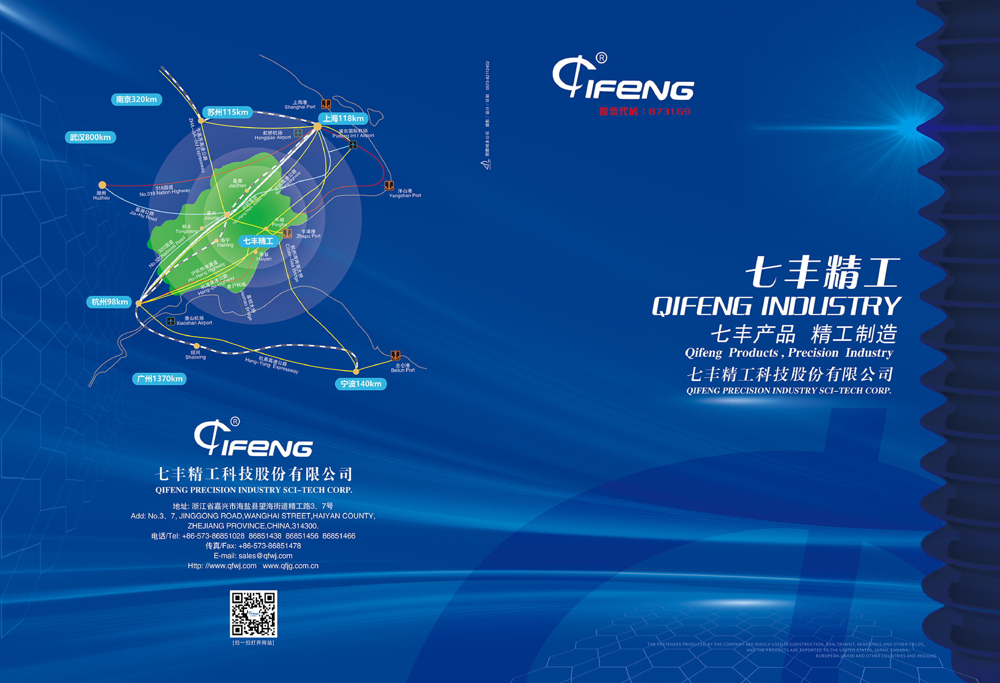

Код акций: 873169

318 национальная автомагистраль / Tel: 0573-82112402

**QIFENG INDUSTRY**
Продукция Qifeng — точная промышленность

**QIFENG PRECISION INDUSTRY SCI-TECH CORP.**
七丰精工科技股份有限公司

**Адрес:** No. 3, 7, Jinggong Road, Wanghai Street, Haiyan County, Jiaxing, Zhejiang Province, China, 314300
**Тел.:** +86-573-86851028, 86851438, 86851456, 86851466
**Факс:** +86-573-86851478
**E-mail:** sales@qfwj.com
**Сайт:** www.qfwj.com, www.qfig.com.cn

[Сканируйте QR-код для перехода на сайт]

---

## Слайд 2

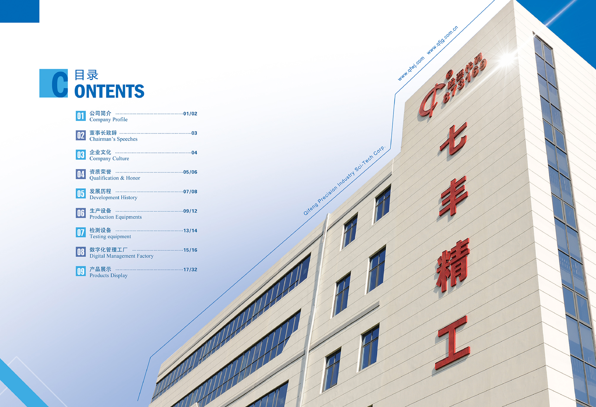

**Содержание**

01/02 — Профиль компании (Company Profile)

03 — Обращение председателя (Chairman's Speeches)

04 — Корпоративная культура (Company Culture)

05/06 — Сертификаты и награды (Qualification & Honor)

07/08 — История развития (Development History)

09/12 — Производственное оборудование (Production Equipments)

13/14 — Испытательное оборудование (Testing equipment)

15–17 — Цифровая управляемая фабрика (Digital Management Factory)

18+ — Каталог продукции (Products Display)

---

## Слайд 3

**Профиль компании**
Company Profile

QIFENG PRECISION INDUSTRY SCI-TECH CORP. — высокотехнологичное предприятие, специализирующееся на НИОКР, производстве, продажах и сервисном обслуживании крепежа среднего и высокого класса; компания котируется на Пекинской фондовой бирже (код акций: 873169). В 2020 году Qifeng получила премию мэра города Цзясин за качество; в 2021 — статусы «специализированное и инновационное» МСП провинции Чжэцзян и «скрытый чемпион»; в 2022 — звание «малого гиганта» четвёртой партии программы «специализированное и инновационное» от Министерства промышленности и информационных технологий КНР.

Компания разрабатывает и производит высокопрочный, высокоточный и высоконадёжный крепёж для авиации и космоса, железнодорожного транспорта, гражданского и промышленного строительства, ветро- и солнечной энергетики. Ассортимент включает стандартный крепёж и нестандартные детали по чертежам заказчика; материалы — углеродистая и легированная сталь, нержавеющая сталь, жаропрочные и титановые сплавы. Qifeng обеспечивает полный цикл услуг: НИОКР, проектирование, производство и контроль качества. Компания входит в реестр квалифицированных поставщиков CNNC, CRRC, VOSSLOH и других известных отечественных и зарубежных предприятий.

---

## Слайд 4

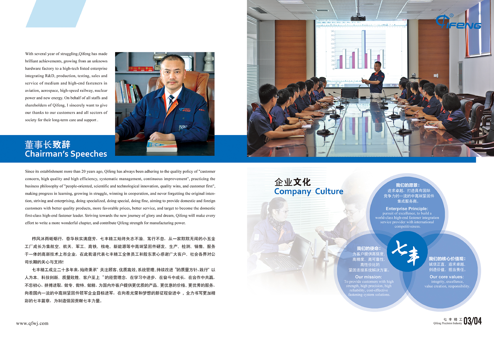

**Обращение председателя**

После многих лет упорной работы Qifeng добилась выдающихся результатов — из малозаметного метизного завода выросла в высокотехнологичную публичную компанию, объединяющую НИОКР, производство, контроль, продажи и сервис крепежа среднего и высокого класса для авиации, космоса, оборонной промышленности, высокоскоростных железных дорог, атомной энергетики и новых источников энергии. От имени всех сотрудников и акционеров Qifeng я искренне благодарю наших клиентов и представителей общества за долгосрочную поддержку и доверие.

За более чем двадцать лет с момента основания Qifeng неизменно следует политике качества «забота о клиенте, высокое качество и эффективность, системное управление, постоянное улучшение» и бизнес-философии «ориентация на людей, технологические инновации, победа качеством, клиент прежде всего». Мы учимся и растём, побеждаем в сотрудничестве, не забываем первоначальные цели, стремимся к специализации и совершенству — чтобы предлагать клиентам в Китае и за рубежом лучшие продукты, более выгодные цены и более высокий уровень сервиса, и стать ведущим отечественным производителем крепежа высокого класса. На новом пути к славе и мечте Qifeng приложит все силы, чтобы написать ещё более яркую главу и внести свой вклад в становление производственной державы.

www.qfwj.com

---

## Слайд 5

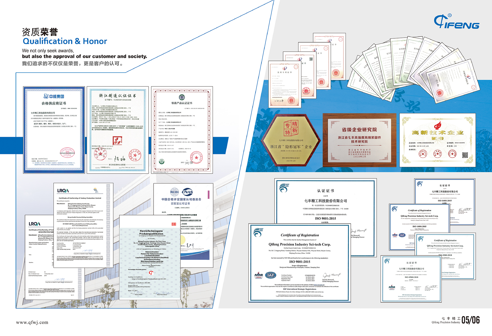

**Сертификаты и награды**
Qualification & Honor

Мы стремимся не только к наградам, но и к признанию со стороны клиентов и общества.

*Краткое содержание слайда (фото сертификатов с OCR-шумом):* коллаж наград и разрешительных документов компании, в том числе:

- ISO 9001:2015 — система менеджмента качества
- Сертификат железнодорожной продукции
- Статус высокотехнологичного предприятия
- Провинциальный корпоративный исследовательский институт «Высокопрочный премиальный крепёж Qifeng» (Чжэцзян)
- Сертификаты квалифицированного поставщика (авиакосмическая отрасль, CNNC и др.)
- Аккредитация лаборатории CNAS
- Сертификат соответствия заводского производственного контроля (CE-подобный)
- Квалификация производителя VOSSLOH (Германия): крюковые болты, болты с проушиной, высокопрочные болты с гайкой, болты для рельсовых подкладок

www.qfwj.com

---

## Слайд 6

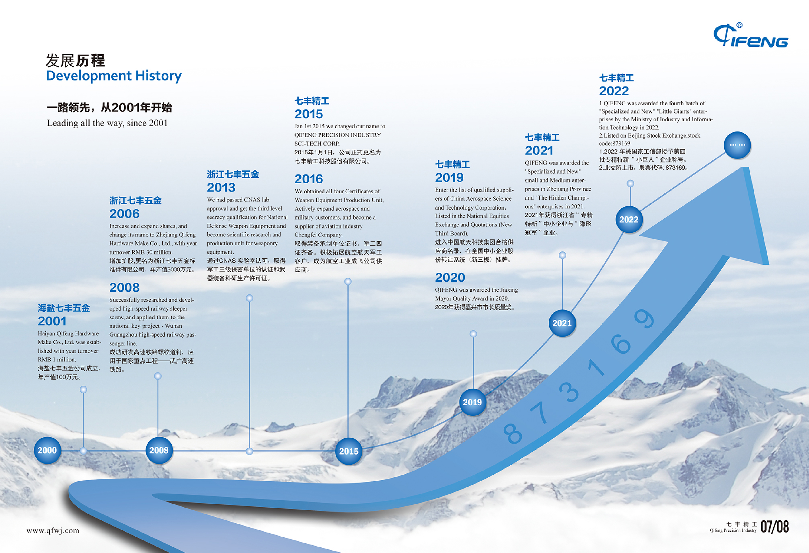

**История развития**
Development History

*Лидируем с 2001 года*

**2001 — Хайянь Qifeng Hardware**
Основана компания Haiyan Qifeng Hardware Make Co., Ltd.; годовой оборот — 1 млн юаней.

**2006 — Zhejiang Qifeng Hardware**
Увеличение и расширение долей акционеров; переименование в Zhejiang Qifeng Hardware Standard Parts Co., Ltd.; годовой оборот — 30 млн юаней.

**2008**
Успешная разработка резьбового рельсового костыля для высокоскоростных железных дорог; применение на объекте национального значения — линии Ухань — Гуанчzhou ВСЖД.

**2013**
Прохождение аккредитации лаборатории CNAS; получение сертификата секретного предприятия III уровня в оборонной сфере и лицензии на НИОКР и производство вооружений.

**2015 — Qifeng Precision Industry**
1 января 2015 года — официальное переименование в QIFENG PRECISION INDUSTRY SCI-TECH CORP.

**2016**
Получены все четыре сертификата предприятия — изготовителя вооружений («военные четыре сертификата»); активное развитие клиентской базы в авиации, космосе и обороне; статус поставщика авиазавода Chengfei (AVIC); включение в реестр квалифицированных поставщиков China Aerospace Science and Technology Corporation; листинг на NEEQ («Новая третья площадка»).

**2020 — Qifeng Precision Industry**
Премия мэра города Цзясин за качество.

**2021 — Qifeng Precision Industry**
Статусы «специализированное и инновационное» МСП провинции Чжэцзян и «скрытый чемпион».

**2022 — Qifeng Precision Industry**
1. Звание «малого гиганта» четвёртой партии программы «специализированное и инновационное» от Министерства промышленности и информационных технологий.
2. Листинг на Пекинской фондовой бирже; код акций: 873169.

Qifeng Precision Industry — 07/08

www.qfwj.com

---

## Слайд 7

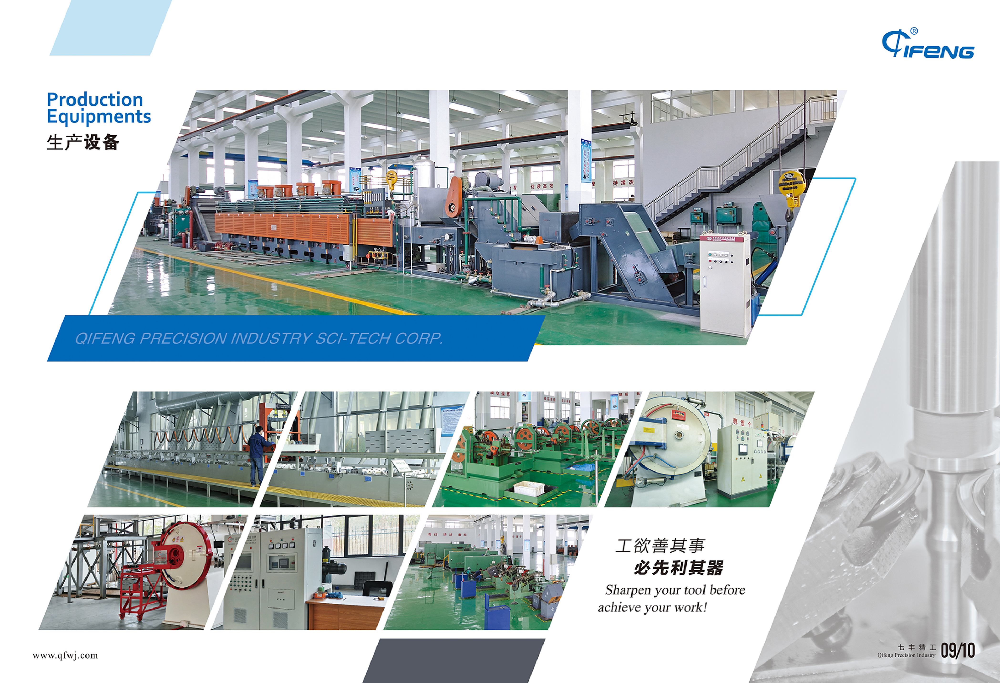

**Производственное оборудование**
Production Equipments

*«Сначала наточи инструмент — потом приступай к работе»*

*Краткое содержание слайда:* обзор производственной базы Qifeng — токарные, фрезерные и кузнечно-прессовые станки, линии холодной высадки и резьбонарезания; демонстрация современного машинного парка для изготовления высокоточного крепежа (стр. 09/10 каталога).

www.qfwj.com

---

## Слайд 8

**Производственное оборудование** (продолжение)

*Краткое содержание слайда:* фотографии дополнительного оборудования цеха — автоматические линии, термообработка, гальваника и вспомогательные установки; продолжение раздела «Production Equipments» (стр. 11/12).

www.qfwj.com

---

## Слайд 9

**Только ради лучшего качества**
*Контроль — основа высочайшего качества.*

**Испытательное оборудование**
Testing equipment

*Краткое содержание слайда:* лаборатория и контрольно-измерительные приборы — твёрдомеры, машины на растяжение, координатно-измерительные системы, приборы для проверки резьбы и геометрии деталей.

www.qfwj.com

---

## Слайд 10

**Цифровая управляемая фабрика**
Digital Management Factory

*Краткое содержание слайда:* система цифрового управления производством — MES/ERP, мониторинг процессов в реальном времени, прослеживаемость партий и интеграция данных с оборудованием; визуализация «умного» цеха Qifeng.

---

## Слайд 11

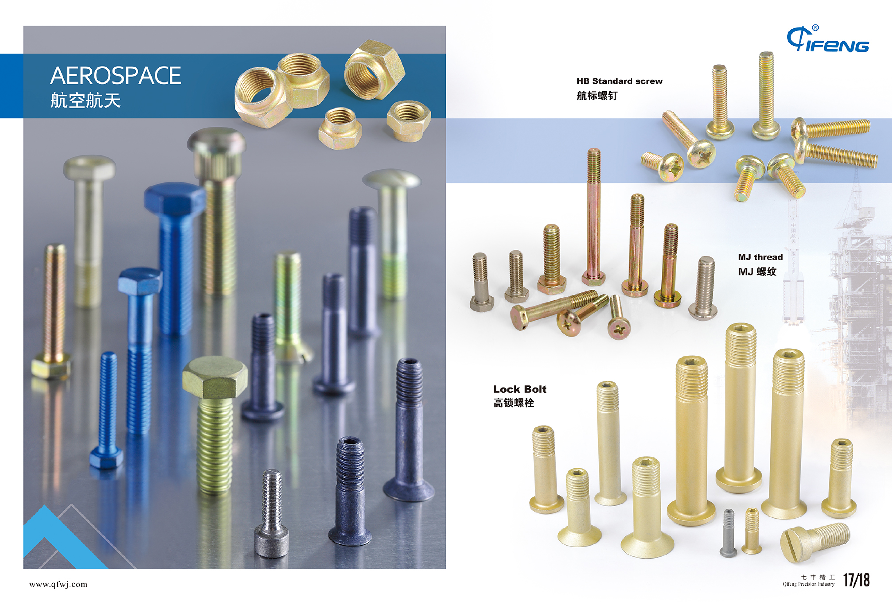

**АВИАКОСМИЧЕСКАЯ ОТРАСЛЬ**
AEROSPACE

- Стандартные винты HB (авиационный стандарт)
- **Высокоблокирующие болты** (Lock Bolt / 高锁螺栓)

*Краткое содержание слайда:* образцы авиационного крепежа — болты и винты для самолётостроения; фото продукции с указанием типоразмеров.

七丰精工 — Qifeng Precision Industry

www.qfwj.com

---

## Слайд 12

**АВИАКОСМИЧЕСКАЯ ОТРАСЛЬ** (продолжение)

- **Гидравлические детали** (Hydraulic Pressure Parts)
- **Трубные соединения** (Tube Connection)

*Краткое содержание слайда:* фittings и соединительные элементы для гидросистем авиационной техники; нестандартные детали по чертежам заказчика.

www.qfwj.com

---

## Слайд 13

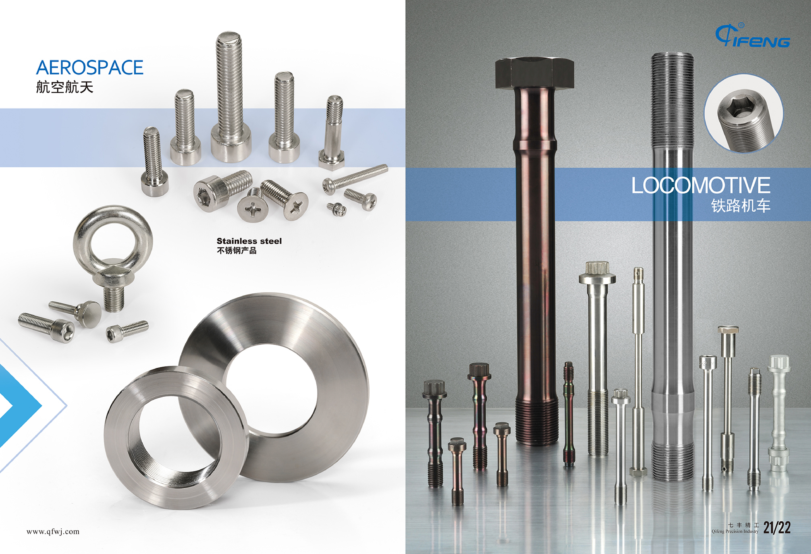

**ЖЕЛЕЗНОДОРОЖНЫЙ ПОДВИЖНОЙ СОСТАВ**
LOCOMOTIVE / 铁路机车

- Изделия из нержавеющей стали (Stainless steel products)

**АВИАКОСМИЧЕСКАЯ ОТРАСЛЬ**
AEROSPACE

*Краткое содержание слайда:* крепёж для локомотивов и вагонов — болты, гайки, шпильки из нержавеющей стали; также показаны авиационные позиции.

www.qfwj.com

---

## Слайд 14

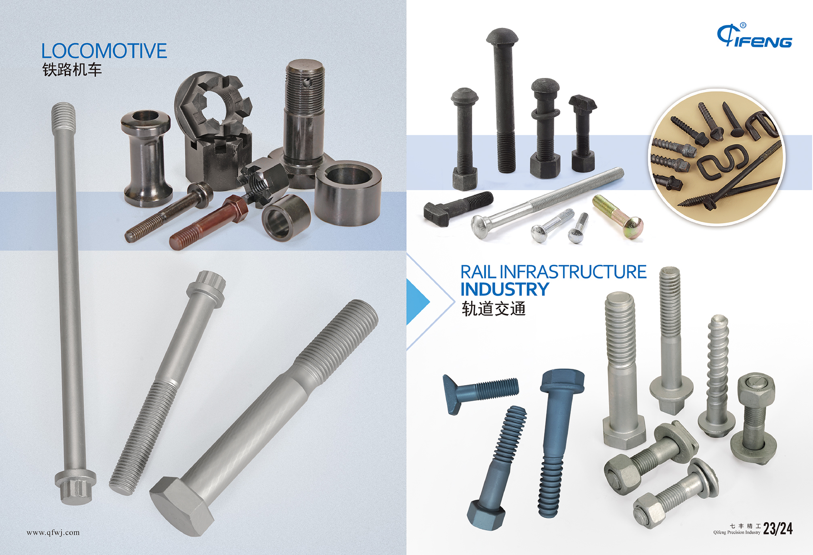

**ЖЕЛЕЗНОДОРОЖНЫЙ ПОДВИЖНОЙ СОСТАВ**
LOCOMOTIVE / 铁路机车

**ИНФРАСТРУКТУРА ЖЕЛЕЗНЫХ ДОРОГ**
RAIL INFRASTRUCTURE INDUSTRY / 轨道交通

*Краткое содержание слайда:* крепёж для путевого хозяйства и подвижного состава — болты для рельсовых стыков, крепления элементов верхнего строения пути.

www.qfwj.com

---

## Слайд 15

**ИНФРАСТРУКТУРА ЖЕЛЕЗНЫХ ДОРОГ**
RAIL INFRASTRUCTURE INDUSTRY / 轨道交通

**Рельсовые костыли (SLEEPER SCREW / 道钉)**
- Размер: M20–M27, 15/16"–1"
- Длина: до 300 мм

*Краткое содержание слайда:* фото резьбовых рельсовых костылей различных типоразмеров для высокоскоростных и обычных железных дорог.

---

## Слайд 16

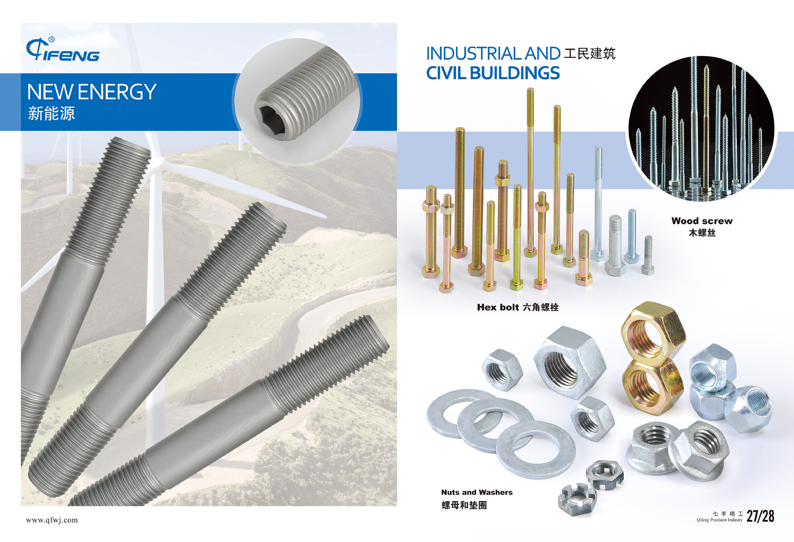

**ПРОМЫШЛЕННОЕ И ГРАЖДАНСКОЕ СТРОИТЕЛЬСТВО**
INDUSTRIAL AND CIVIL BUILDINGS / 工民建筑

**НОВАЯ ЭНЕРГЕТИКА**
NEW ENERGY

- **Деревянные винты** (Wood screw / 木螺丝)
- **Шестигранные болты** (Hex bolt / 六角螺栓)

*Краткое содержание слайда:* крепёж для строительных конструкций и объектов ветро- и солнечной энергетики.

www.qfwj.com

---

## Слайд 17

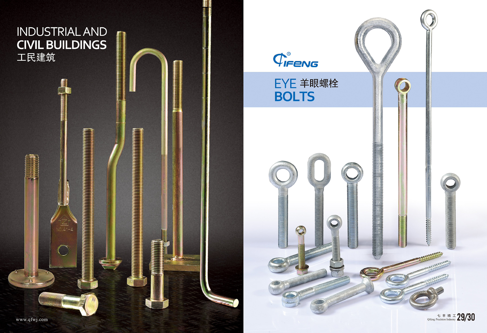

**ПРОМЫШЛЕННОЕ И ГРАЖДАНСКОЕ СТРОИТЕЛЬСТВО**
INDUSTRIAL AND CIVIL BUILDING

- **Болты с кольцом («болты-ушки»)** (EYE BOLTS / 羊眼螺栓)

*Краткое содержание слайда:* различные типы болтов с проушиной для такелажа и монтажа строительных конструкций.

七丰精工 — Qifeng Precision Industry

---

## Слайд 18

**НЕСТАНДАРТНЫЕ ИЗДЕЛИЯ**
NON-STANDARD PARTS / 非标件

**ЭЛЕКТРОЭНЕРГЕТИКА**
ELECTRIC POWER / 电力产品

*Краткое содержание слайда:* нестандартный крепёж и детали по чертежам заказчика; изделия для энергетической отрасли (опоры ЛЭП, подстанции, оборудование).

www.qfwj.com
