# Zhengling Machinery — обзор компании

Источник: [`正菱机械科技股份有限公司简介.ppt`](../正菱机械科技股份有限公司简介.ppt)

Оригинал: [content.md](content.md)

---

## Слайд 1

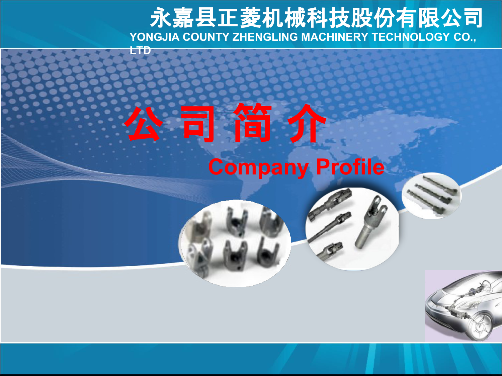

Профиль компании
Company Profile

Yongjia County Zhengling Machinery Technology Co., Ltd.
永嘉县正菱机械科技股份有限公司

---

## Слайд 2

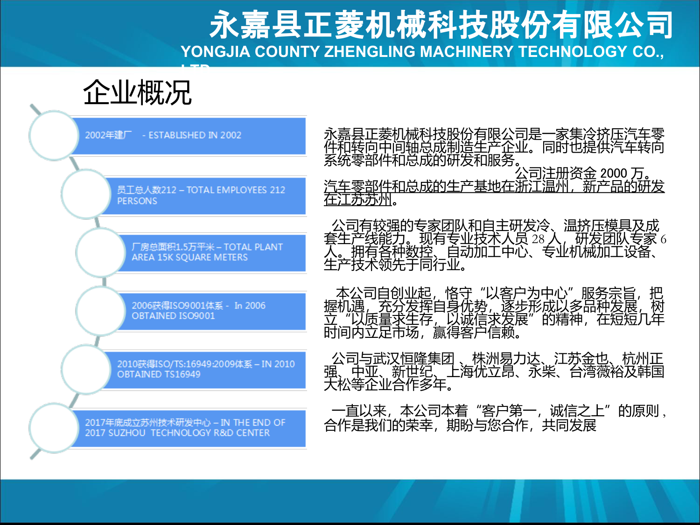

Обзор предприятия

Yongjia County Zhengling Machinery Technology Co., Ltd. — предприятие, специализирующееся на производстве автомобильных деталей методом холодной высадки и сборок промежуточного вала рулевого управления. Компания также занимается разработкой и поставкой компонентов и узлов рулевой системы. Оказывает услуги по НИОКР и обработке деталей рулевой и трансмиссионной систем. Уставный капитал — 20 млн юаней. Производственная база автомобильных компонентов и узлов расположена в Вэньчжоу (пров. Чжэцзян), НИОКР новых продуктов — в Сучжоу (пров. Цзянсу).

Компания располагает сильной командой экспертов и самостоятельными компетенциями в разработке штампов для холодной и тёплой высадки и комплектных производственных линий. В штате 28 специалистов по производственным технологиям, 6 экспертов в команде НИОКР. Используются различные станки с ЧПУ, автоматические обрабатывающие центры и специализированное оборудование для механической обработки; производственные технологии опережают отраслевой уровень.

С момента основания компания придерживается принципа «клиент в центре внимания», использует возможности роста и постепенно развивает широкую номенклатуру продукции. Руководствуется девизом «выживать за счёт качества, развиваться за счёт добросовестности» и за короткий срок заняла прочные позиции на рынке, завоевав доверие клиентов.

Компания много лет сотрудничает с Wuhan Henglong Group, Zhuzhou Yilida, Jiangsu Jinye, Hangzhou Zhengqiang, Zhongya, New Century, Shanghai Youliang, Yongchai, Taiwan Weiyu, Korea Daesong и другими предприятиями.

Компания всегда руководствуется принципом «клиент на первом месте, честность превыше всего». Сотрудничество — наша честь; надеемся на совместное развитие с вами.

Yongjia County Zhengling Machinery Technology Co., Ltd.
永嘉县正菱机械科技股份有限公司

---

## Слайд 3

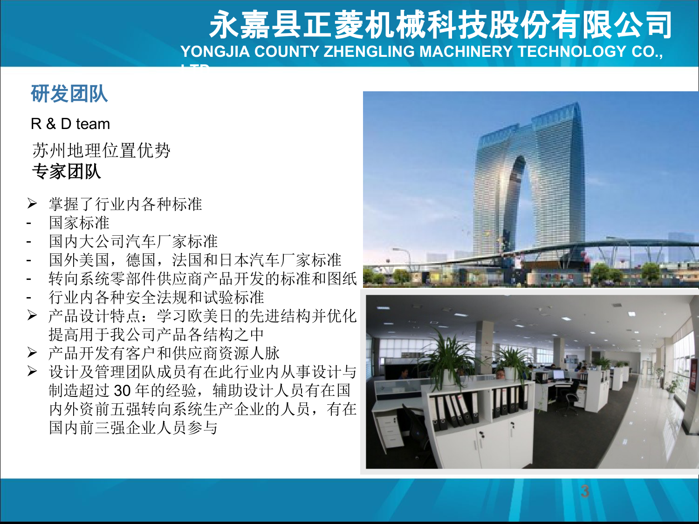

Команда НИОКР
R & D team

Географическое преимущество Сучжоу

Команда экспертов

- Владение всеми отраслевыми стандартами:
  - государственные стандарты;
  - стандарты крупных отечественных автопроизводителей;
  - стандарты автопроизводителей США, Германии, Франции и Японии;
  - стандарты и чертежи разработки продукции поставщиков компонентов рулевой системы;
  - отраслевые нормы безопасности и испытательные стандарты.
- Особенности проектирования: изучение передовых конструкций Европы, США и Японии с их оптимизацией и применением в продукции компании.
- Разработка продуктов опирается на ресурсы и связи с клиентами и поставщиками.
- Члены команды проектирования и управления имеют более 30 лет опыта в отрасли; вспомогательный персонал — из пяти ведущих иностранных производителей рулевых систем и из трёх крупнейших отечественных предприятий отрасли.

Yongjia County Zhengling Machinery Technology Co., Ltd.
永嘉县正菱机械科技股份有限公司

---

## Слайд 4

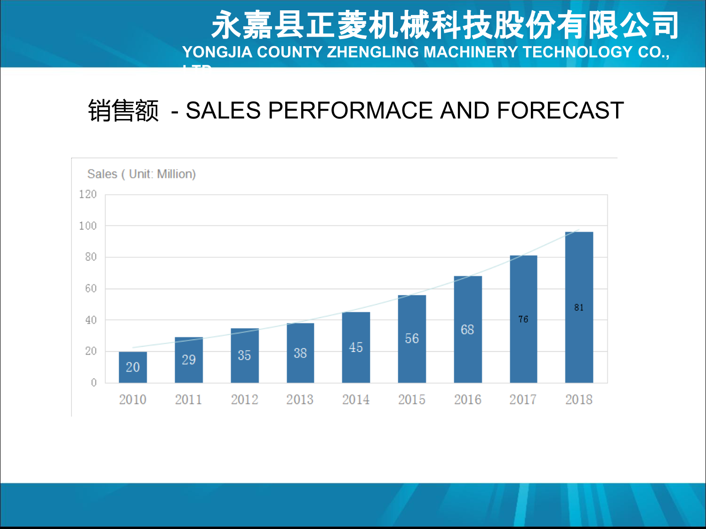

Динамика продаж и прогноз (график на слайде)
SALES PERFORMANCE AND FORECAST

Yongjia County Zhengling Machinery Technology Co., Ltd.
永嘉县正菱机械科技股份有限公司

---

## Слайд 5

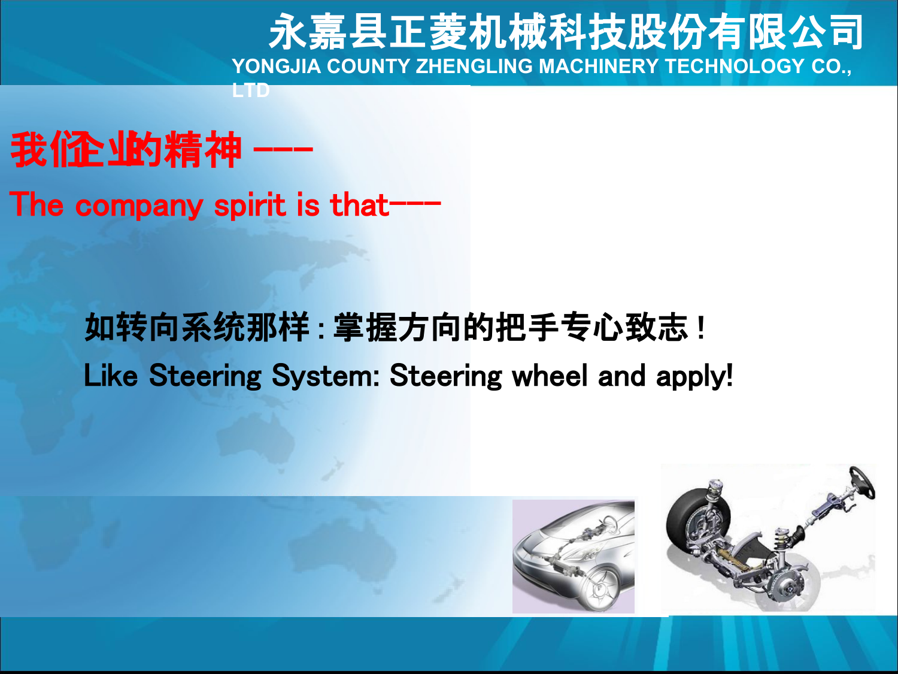

Дух нашей компании
The company spirit is that---

Как рулевая система: руль задаёт направление — действуй с полной отдачей!

Like Steering System: Steering wheel and apply!

Yongjia County Zhengling Machinery Technology Co., Ltd.
永嘉县正菱机械科技股份有限公司

---

## Слайд 6

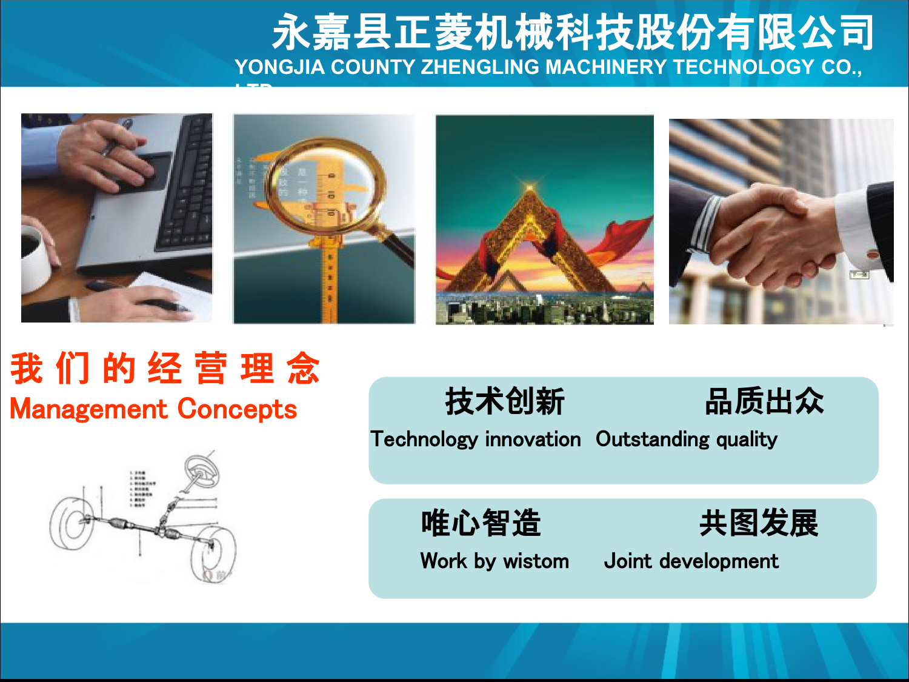

Технологические инновации — выдающееся качество
Technology innovation  Outstanding quality

Наши принципы управления
Management Concepts

Создавать с умом — развиваться вместе
Work by wistom     Joint development

Yongjia County Zhengling Machinery Technology Co., Ltd.
永嘉县正菱机械科技股份有限公司

---

## Слайд 7

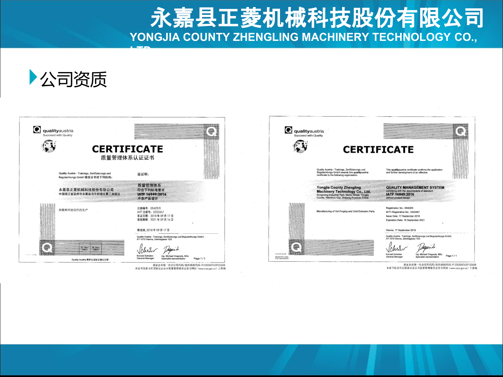

Сертификаты и лицензии компании

Yongjia County Zhengling Machinery Technology Co., Ltd.
永嘉县正菱机械科技股份有限公司

---

## Слайд 8

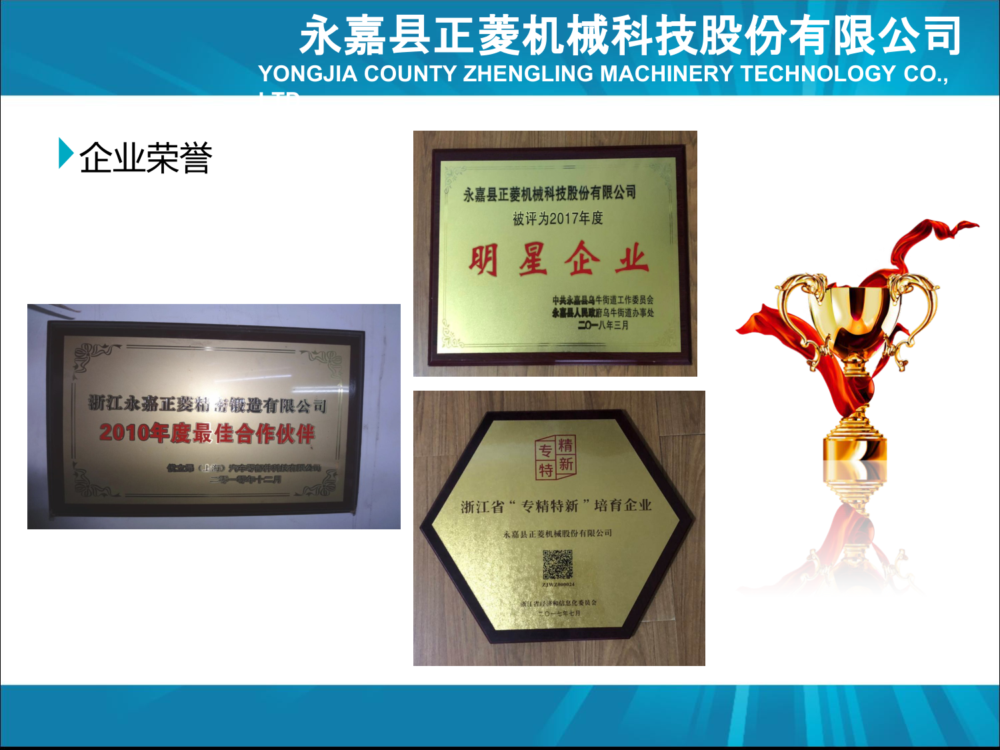

Награды предприятия

Yongjia County Zhengling Machinery Technology Co., Ltd.
永嘉县正菱机械科技股份有限公司

---

## Слайд 9

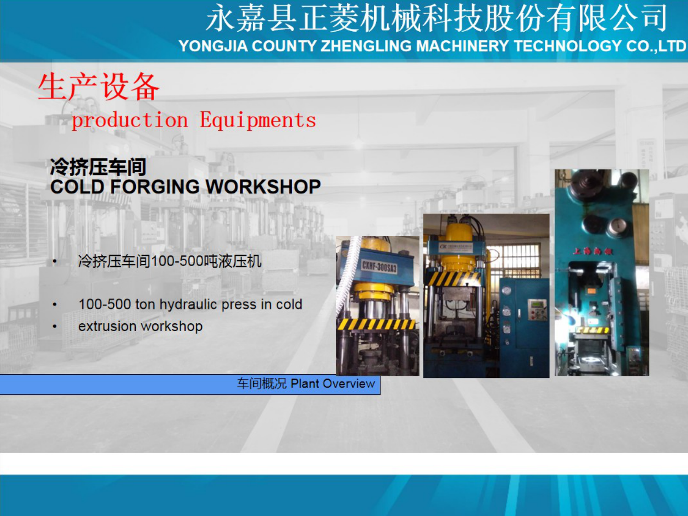

См. изображение

Yongjia County Zhengling Machinery Technology Co., Ltd.
永嘉县正菱机械科技股份有限公司

---

## Слайд 10

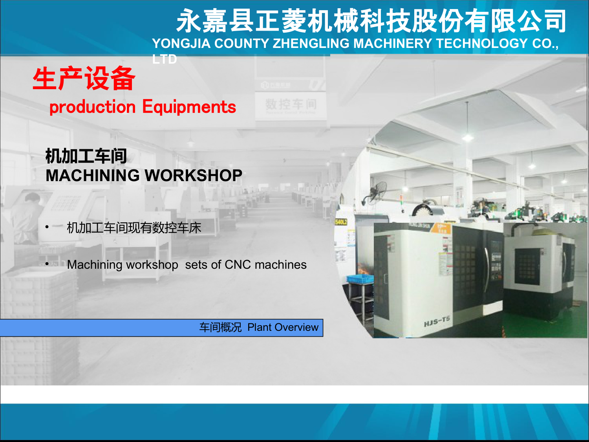

Механообрабатывающий цех
MACHINING WORKSHOP

- В механообрабатывающем цехе установлены токарные станки с ЧПУ
- Machining workshop sets of CNC machines

Обзор цеха
Plant Overview

Производственное оборудование
production Equipments

Yongjia County Zhengling Machinery Technology Co., Ltd.
永嘉县正菱机械科技股份有限公司

---

## Слайд 11

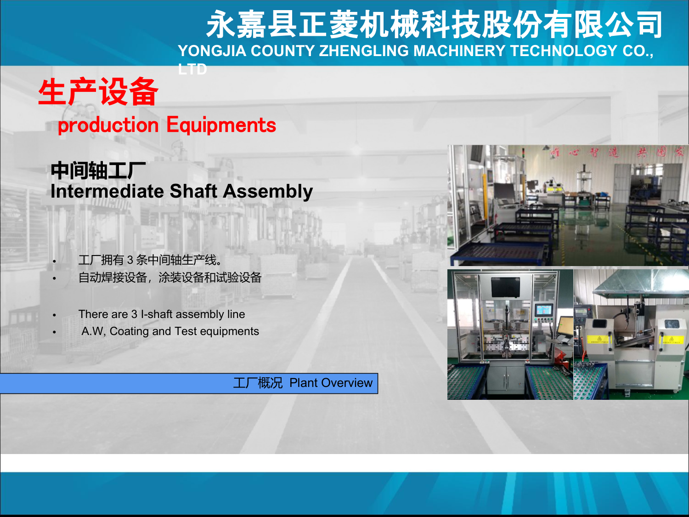

- На заводе три линии сборки промежуточного вала.
- Оборудование для автоматической сварки, покрытия и испытаний
- There are 3 I-shaft assembly line
- A.W, Coating and Test equipments

Обзор завода
Plant Overview

Завод промежуточных валов
Intermediate Shaft Assembly

Производственное оборудование
production Equipments

Yongjia County Zhengling Machinery Technology Co., Ltd.
永嘉县正菱机械科技股份有限公司

---

## Слайд 12

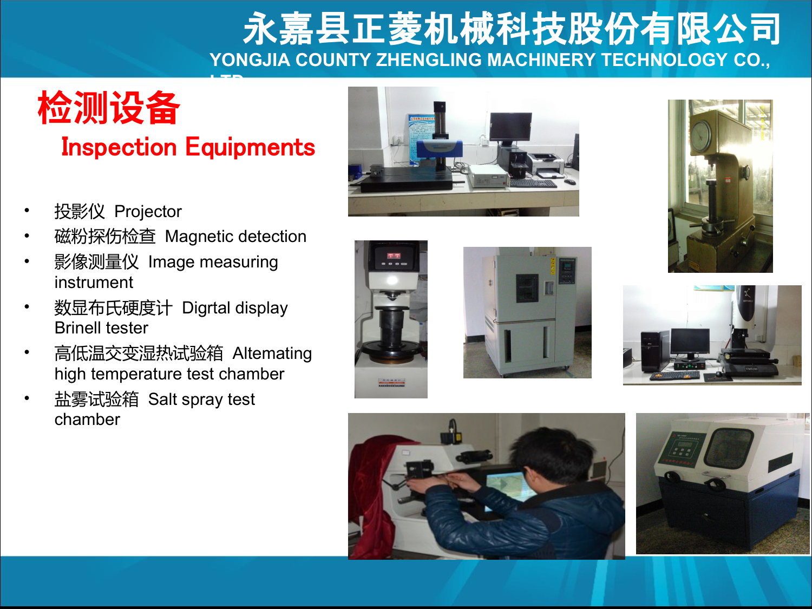

Контрольно-измерительное оборудование
Inspection Equipments

- Проектор / Projector
- Магнитопорошковый контроль / Magnetic detection
- Оптико-измерительный прибор / Image measuring instrument
- Твердомер Бринелля с цифровым дисплеем / Digrtal display Brinell tester
- Камера циклических испытаний на высокую температуру и влажность / Altemating high temperature test chamber
- Камера соляного тумана / Salt spray test chamber

Yongjia County Zhengling Machinery Technology Co., Ltd.
永嘉县正菱机械科技股份有限公司

---

## Слайд 13

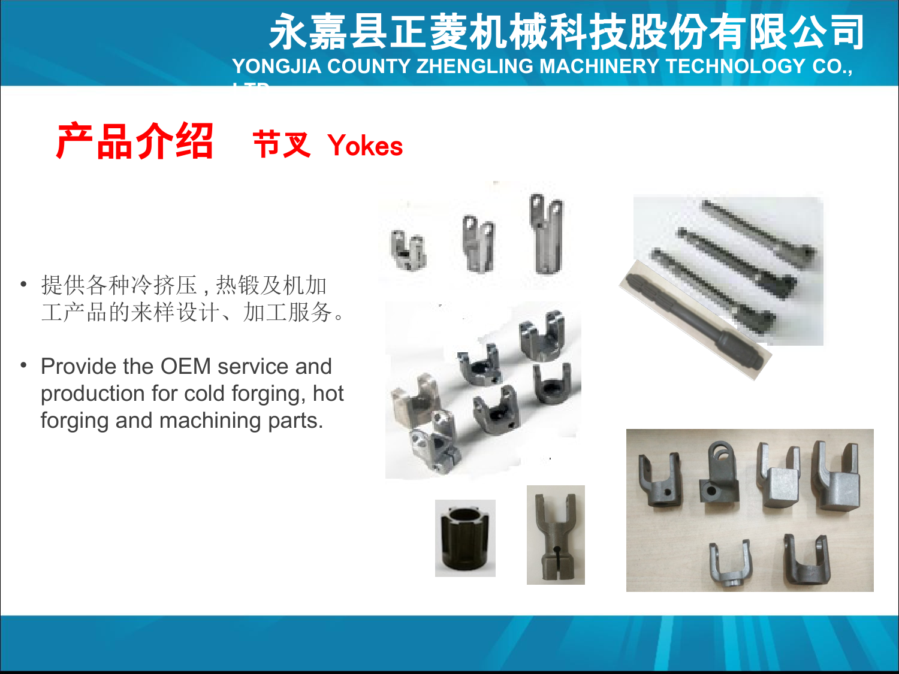

- Разработка и обработка по образцам заказчика для изделий холодной и горячей высадки и механической обработки.
- Provide the OEM service and production for cold forging, hot forging and machining parts.

Презентация продукции — Yoke (вилки)

Yongjia County Zhengling Machinery Technology Co., Ltd.
永嘉县正菱机械科技股份有限公司

---

## Слайд 14

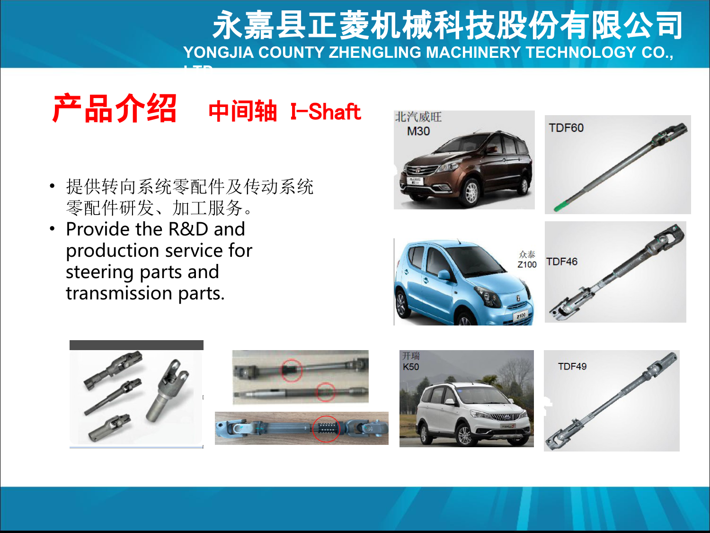

Линейка продукции — Product line

- НИОКР и производство компонентов рулевой и трансмиссионной систем.
- Provide the R&D and production service for steering parts and transmission parts.

Презентация продукции — промежуточный вал I-Shaft

Yongjia County Zhengling Machinery Technology Co., Ltd.
永嘉县正菱机械科技股份有限公司

---

## Слайд 15

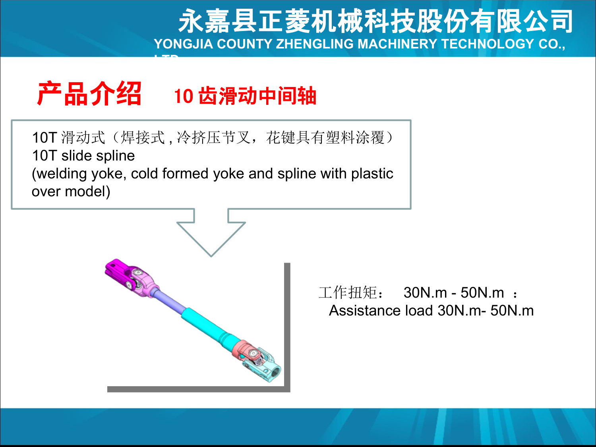

Презентация продукции — 10T скользящий промежуточный вал

10T скользящий тип (сварной yoke, yoke холодной высадки, spline с пластиковым покрытием)
10T slide spline
(welding yoke, cold formed yoke and spline with plastic over model)

Рабочий момент: 30 N·m – 50 N·m
Assistance load 30N.m- 50N.m

Yongjia County Zhengling Machinery Technology Co., Ltd.
永嘉县正菱机械科技股份有限公司

---

## Слайд 16

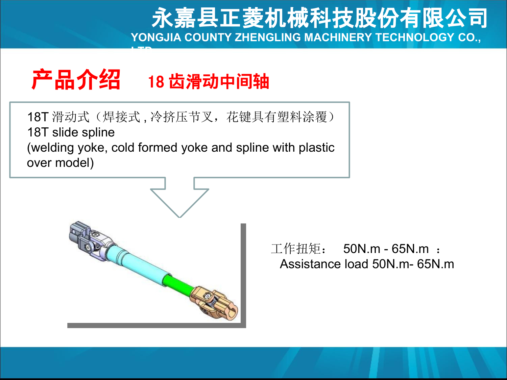

Презентация продукции — 18T скользящий промежуточный вал

18T скользящий тип (сварной yoke, yoke холодной высадки, spline с пластиковым покрытием)
18T slide spline
(welding yoke, cold formed yoke and spline with plastic over model)

Рабочий момент: 50 N·m – 65 N·m
Assistance load 50N.m- 65N.m

Yongjia County Zhengling Machinery Technology Co., Ltd.
永嘉县正菱机械科技股份有限公司

---

## Слайд 17

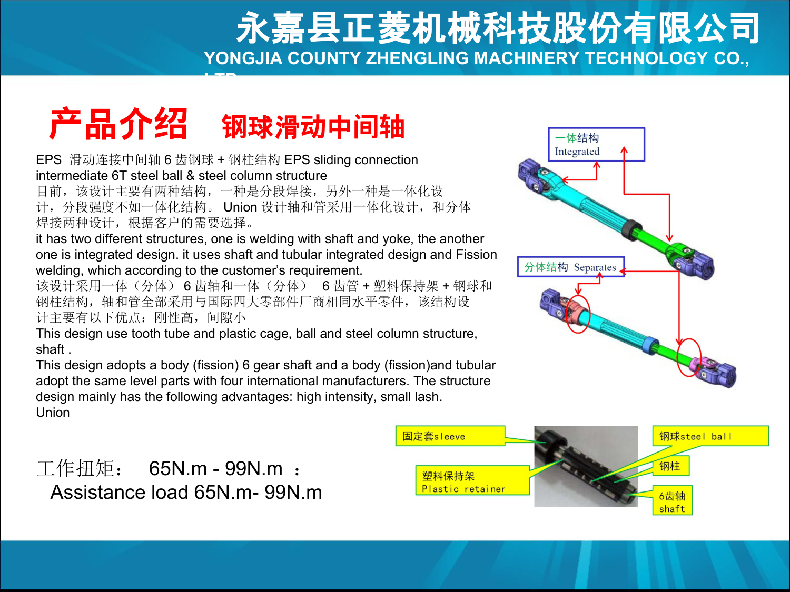

Презентация продукции — EPS скользящий промежуточный вал со стальными шариками

Рабочий момент: 65 N·m – 99 N·m
Assistance load 65N.m- 99N.m

EPS скользящее соединение промежуточного вала: 6-зубчатая конструкция со стальными шариками и стальными втулками
EPS sliding connection intermediate 6T steel ball & steel column structure

В настоящее время для этой конструкции используются два основных варианта: секционная сварка и монолитная конструкция; прочность секционного варианта ниже монолитного. Конструкция Union: вал и труба выполнены как единое целое или как раздельные свариваемые элементы — выбор зависит от требований заказчика.
it has two different structures, one is welding with shaft and yoke, the another one is integrated design. it uses shaft and tubular integrated design and Fission welding, which according to the customer's requirement.

Конструкция использует 6-зубчатый вал и 6-зубчатую трубу (монолитные или раздельные) + пластиковый сепаратор + стальные шарики и втулки; вал и труба изготавливаются из деталей того же уровня, что у четырёх крупнейших мировых производителей компонентов. Преимущества конструкции: высокая жёсткость, малый зазор.
This design use tooth tube and plastic cage, ball and steel column structure, shaft .
This design adopts a body (fission) 6 gear shaft and a body (fission)and tubular adopt the same level parts with four international manufacturers. The structure design mainly has the following advantages: high intensity, small lash.

Union

Yongjia County Zhengling Machinery Technology Co., Ltd.
永嘉县正菱机械科技股份有限公司

---

## Слайд 18

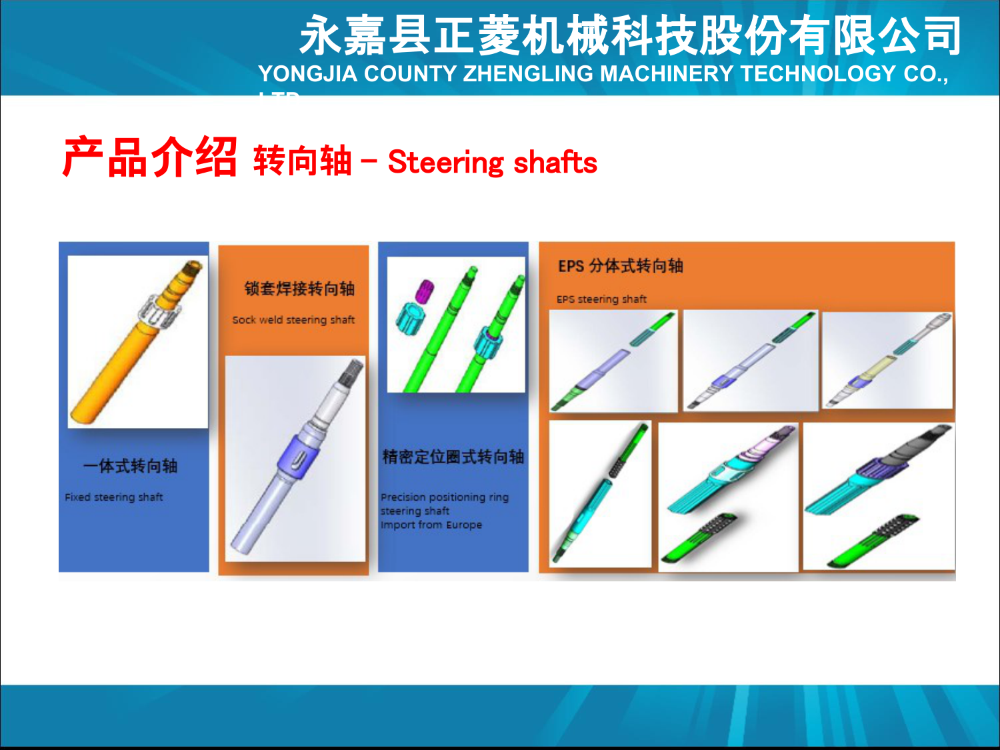

Презентация продукции — рулевые валы
Steering shafts

Yongjia County Zhengling Machinery Technology Co., Ltd.
永嘉县正菱机械科技股份有限公司

---

## Слайд 19

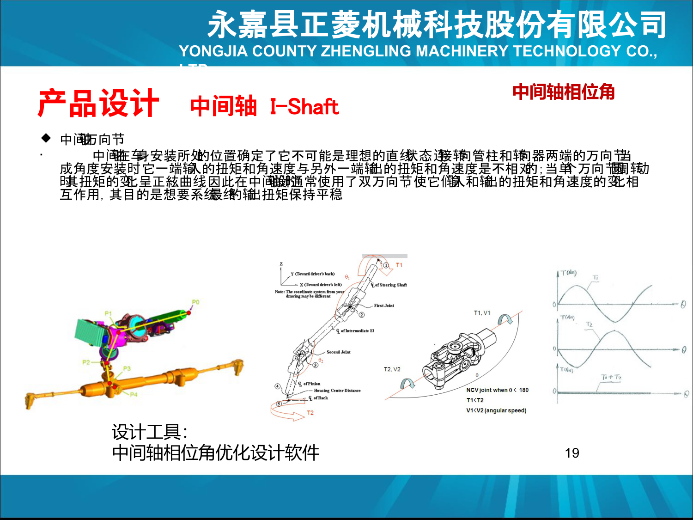

19

Карданный шарнир промежуточного вала:

Положение промежуточного вала в кузове автомобиля не может быть идеально прямым; карданные шарниры на стыке с рулевой колонкой и рулевым механизмом устанавливаются под углом. Входной крутящий момент и угловая скорость на одном конце не совпадают с выходными на другом; при вращении одного карданного шарнира изменение крутящего момента описывает синусоиду. Поэтому в промежуточном вале обычно применяют двойной карданный шарнир, чтобы входной и выходной моменты и угловые скорости взаимно компенсировали друг друга — цель: обеспечить стабильный выходной крутящий момент рулевой системы.

Угол фазировки промежуточного вала

Проектирование I-Shaft

Инструмент проектирования:
ПО оптимизации угла фазировки промежуточного вала

Yongjia County Zhengling Machinery Technology Co., Ltd.
永嘉县正菱机械科技股份有限公司

---

## Слайд 20

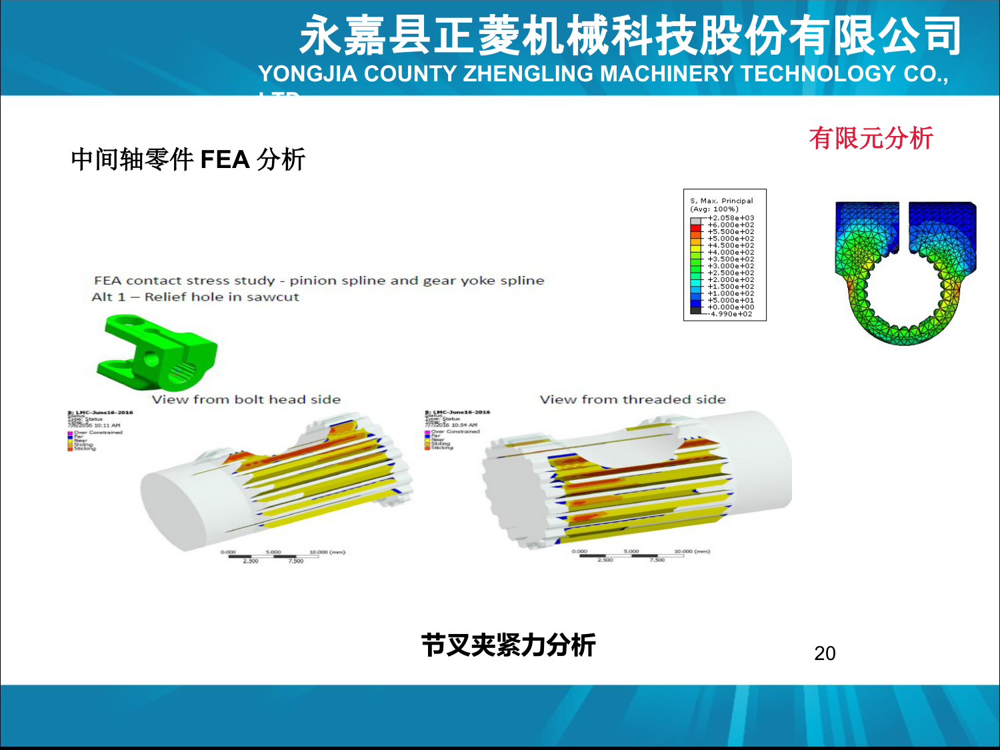

20

FEA-анализ деталей промежуточного вала
Анализ усилия зажима yoke
Конечно-элементный анализ

Yongjia County Zhengling Machinery Technology Co., Ltd.
永嘉县正菱机械科技股份有限公司

---

## Слайд 21

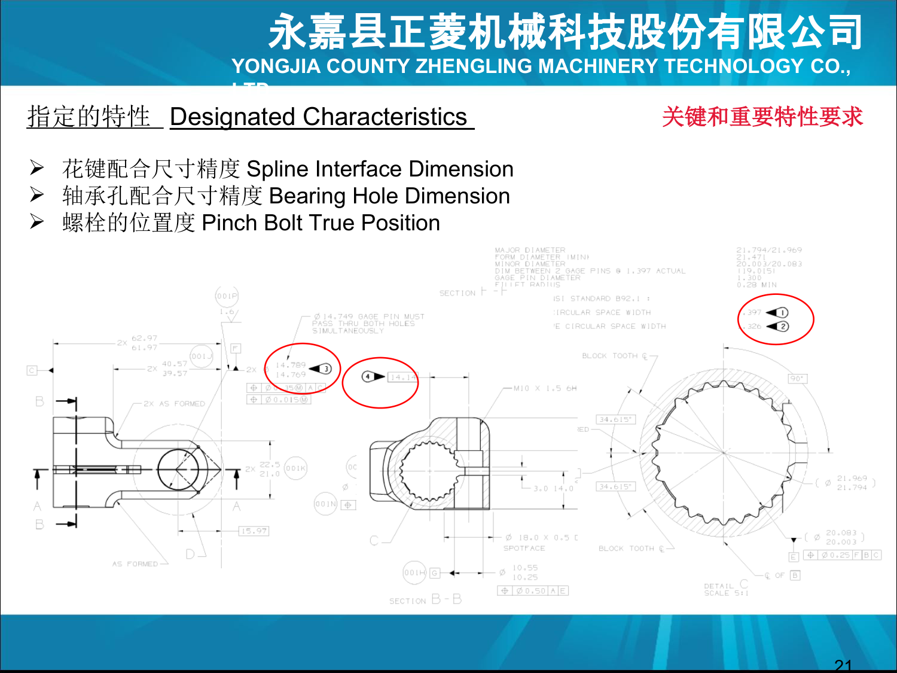

21

- Точность размеров посадки spline / Spline Interface Dimension
- Точность размеров посадки отверстия под подшипник / Bearing Hole Dimension
- Позиционирование болта / Pinch Bolt True Position

Заданные характеристики
Designated Characteristics

Требования к ключевым и важным характеристикам

Yongjia County Zhengling Machinery Technology Co., Ltd.
永嘉县正菱机械科技股份有限公司

---

## Слайд 22

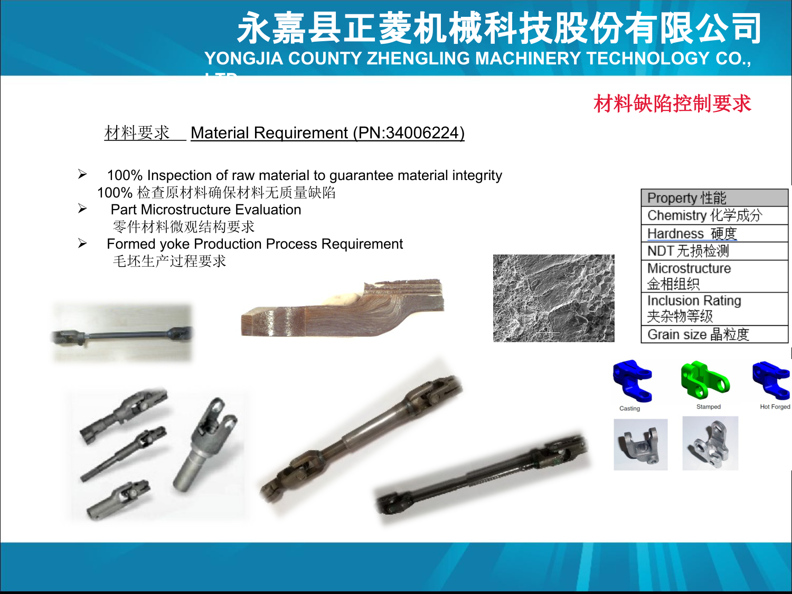

- 100% контроль сырья для гарантии целостности материала
  100% Inspection of raw material to guarantee material integrity
- Оценка микроструктуры детали
  Part Microstructure Evaluation
- Требования к процессу производства штампованных yoke
  Formed yoke Production Process Requirement

Требования к материалам
Material Requirement (PN:34006224)

Требования к контролю дефектов материала

Yongjia County Zhengling Machinery Technology Co., Ltd.
永嘉县正菱机械科技股份有限公司

---

## Слайд 23

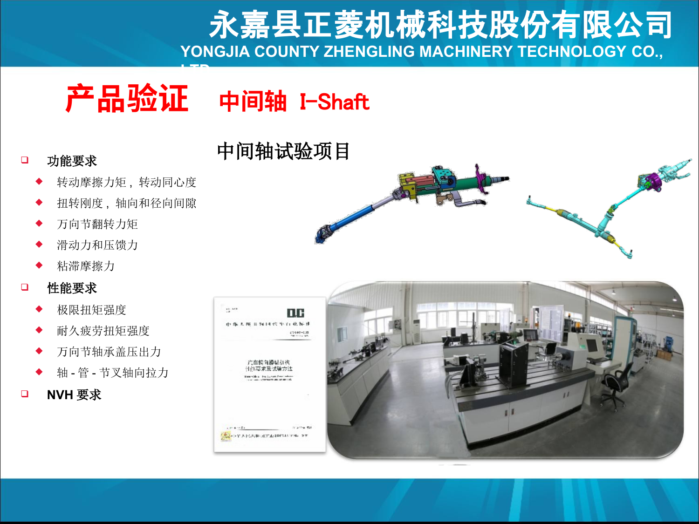

Программа испытаний промежуточного вала

Функциональные требования:
- момент трения при вращении, соосность вращения;
- крутильная жёсткость, осевой и радиальный зазоры;
- момент проворачивания карданного шарнира;
- усилие скольжения и усилие смятия;
- вязкое трение.

Требования к характеристикам:
- предельная прочность на кручение;
- прочность на усталость при кручении;
- усилие выдавливания крышки подшипника карданного шарнира;
- осевое усилие растяжения вала–трубы–yoke.

Требования NVH

Валидация продукции — I-Shaft

Yongjia County Zhengling Machinery Technology Co., Ltd.
永嘉县正菱机械科技股份有限公司

---

## Слайд 24

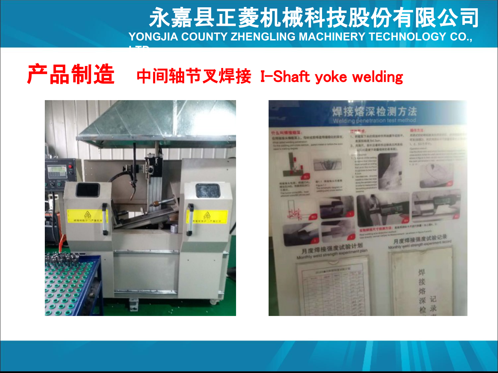

Производство — сварка yoke промежуточного вала
I-Shaft yoke welding

Yongjia County Zhengling Machinery Technology Co., Ltd.
永嘉县正菱机械科技股份有限公司

---

## Слайд 25

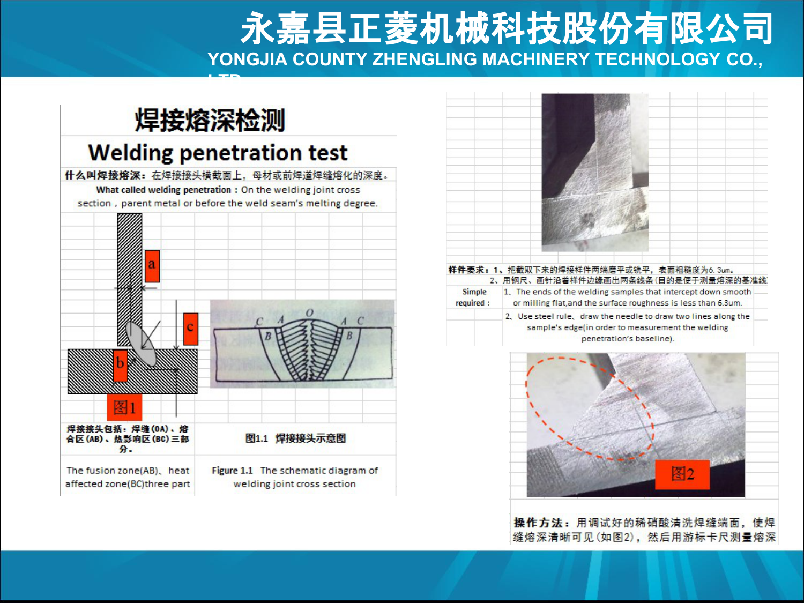

См. изображение

Yongjia County Zhengling Machinery Technology Co., Ltd.
永嘉县正菱机械科技股份有限公司

---

## Слайд 26

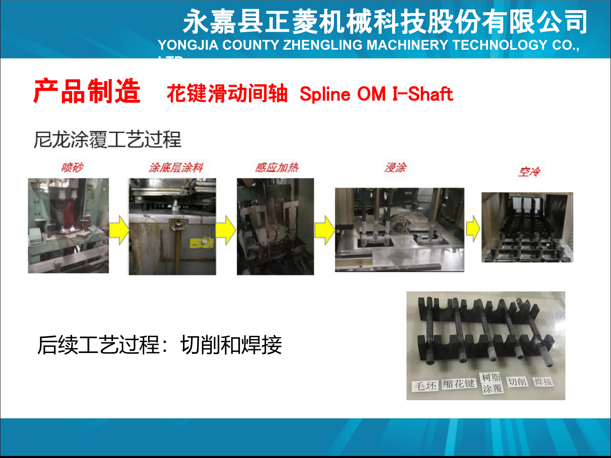

Последующие технологические операции: резание и сварка

Производство — скользящий промежуточный вал со spline
Spline OM I-Shaft

Yongjia County Zhengling Machinery Technology Co., Ltd.
永嘉县正菱机械科技股份有限公司

---

## Слайд 27

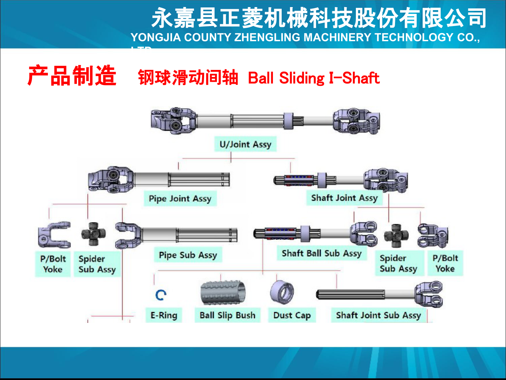

Производство — промежуточный вал со стальными шариками
Ball Sliding I-Shaft

Yongjia County Zhengling Machinery Technology Co., Ltd.
永嘉县正菱机械科技股份有限公司

---

## Слайд 28

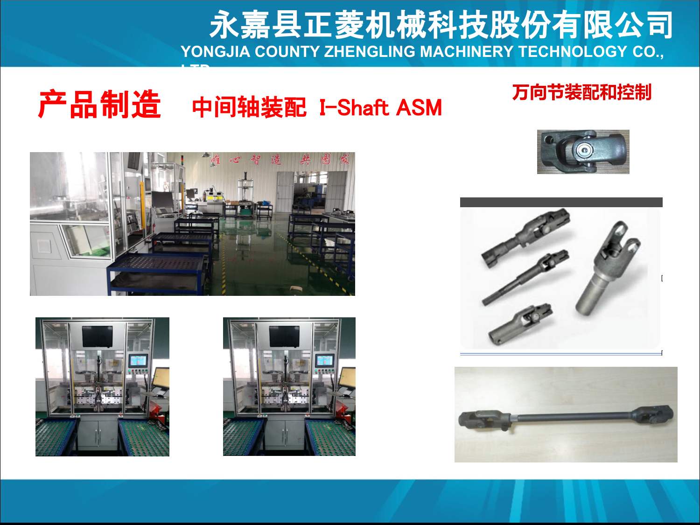

Производство — сборка промежуточного вала
I-Shaft ASM

Сборка и контроль карданных шарниров

Yongjia County Zhengling Machinery Technology Co., Ltd.
永嘉县正菱机械科技股份有限公司

---

## Слайд 29

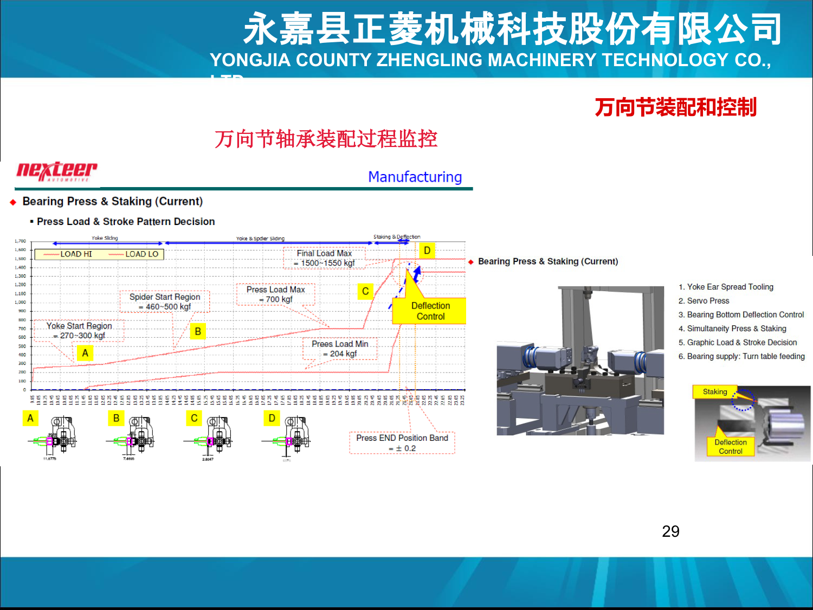

29

Мониторинг процесса установки подшипников карданного шарнира

Сборка и контроль карданных шарниров

Yongjia County Zhengling Machinery Technology Co., Ltd.
永嘉县正菱机械科技股份有限公司

---

## Слайд 30

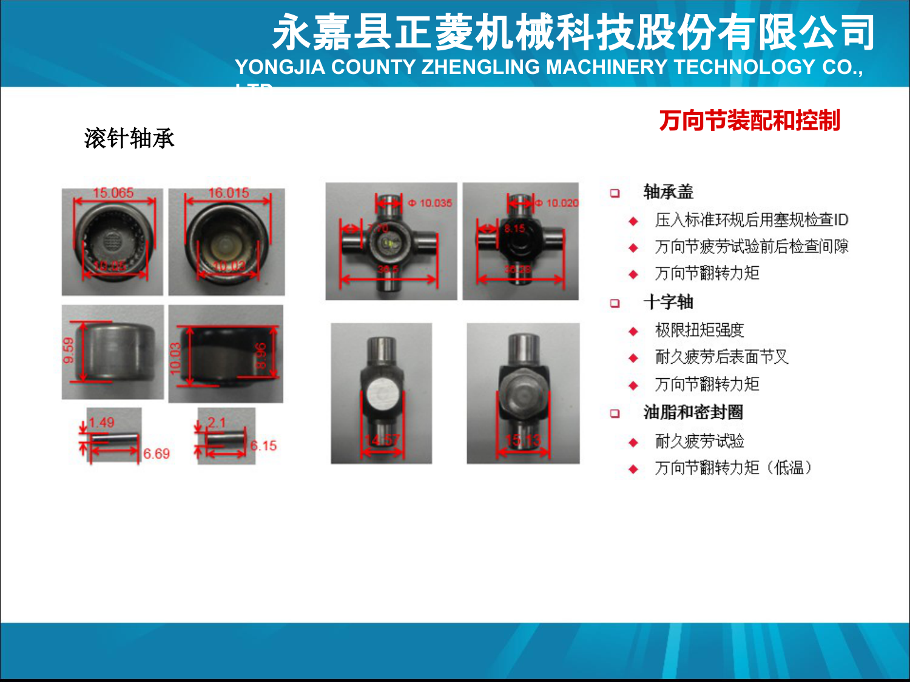

Контроль процесса на линии карданных шарниров

1) контроль момента проворачивания; 2) контроль торцевого зазора

Игольчатые подшипники

Сборка и контроль карданных шарниров

Yongjia County Zhengling Machinery Technology Co., Ltd.
永嘉县正菱机械科技股份有限公司

---

## Слайд 31

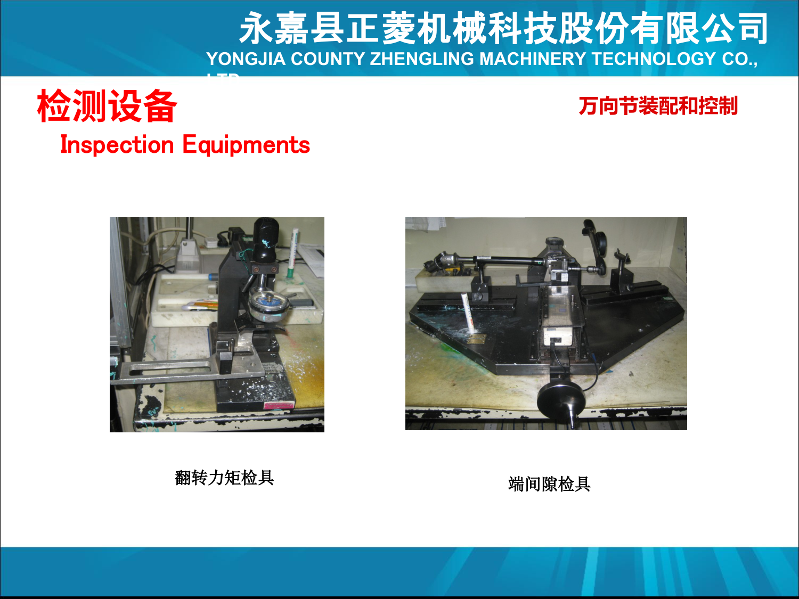

Контроль процесса на линии карданных шарниров

1) контроль момента проворачивания; 2) контроль торцевого зазора

Контрольный стенд момента проворачивания
Контрольный стенд торцевого зазора

Сборка и контроль карданных шарниров

Контрольно-измерительное оборудование
Inspection Equipments

Yongjia County Zhengling Machinery Technology Co., Ltd.
永嘉县正菱机械科技股份有限公司

---

## Слайд 32

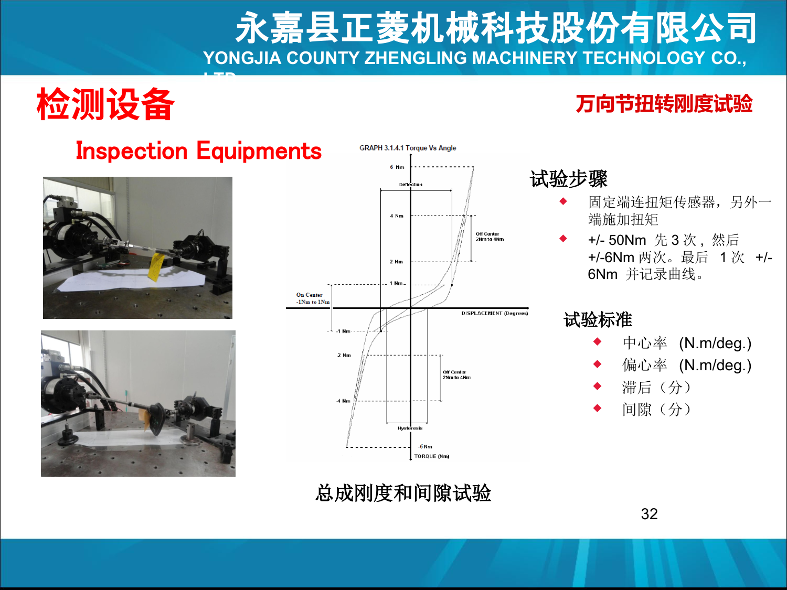

32

Испытание жёсткости и зазоров узла
Испытание крутильной жёсткости карданного шарнира

Порядок испытания:
- на фиксированном конце подключить датчик крутящего момента, на другом конце приложить момент;
- ±50 Nm — 3 цикла, затем ±6 Nm — 2 цикла; последний цикл ±6 Nm с записью кривой.

Критерии испытания:
- центральная жёсткость (N·m/deg.);
- эксцентриситет (N·m/deg.);
- гистерезис (мин.);
- зазор (мин.).

Контрольно-измерительное оборудование
Inspection Equipments

Yongjia County Zhengling Machinery Technology Co., Ltd.
永嘉县正菱机械科技股份有限公司

---

## Слайд 33

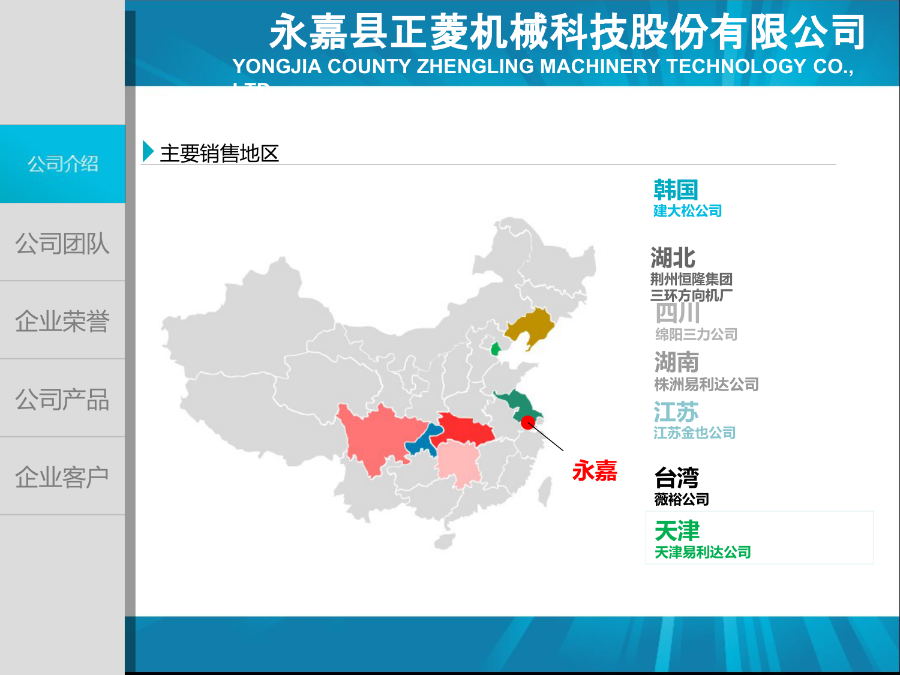

Команда компании
Награды предприятия
Продукция компании
Клиенты предприятия
Основные регионы продаж

| Регион | Клиент |
|--------|--------|
| Хунань | Zhuzhou Yilida |
| Цзянсу | Jiangsu Jinye |
| Корея | Daesong |
| Сычуань | Mianyang Sanli |
| Хубэй | Jingzhou Henglong Group, Sanhuan Steering Gear Factory |
| Тайвань | Weiyu |
| Тяньцзинь | Tianjin Yilida |

Yongjia County Zhengling Machinery Technology Co., Ltd.
永嘉县正菱机械科技股份有限公司

---

## Слайд 34

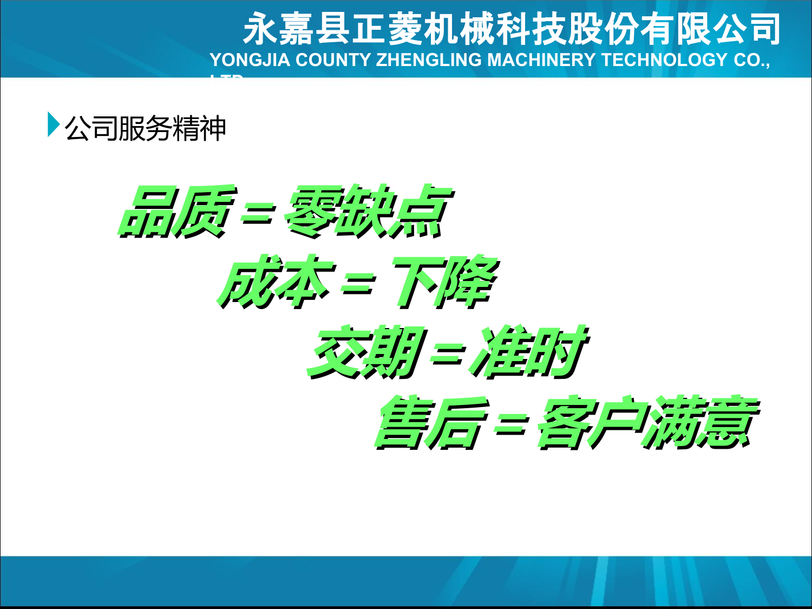

Качество = нулевой дефект
Качество = нулевой дефект

Стоимость = снижение
Стоимость = снижение

Срок поставки = точно в срок
Срок поставки = точно в срок

Послепродажное обслуживание = довольный клиент
Послепродажное обслуживание = довольный клиент

Дух обслуживания компании

Yongjia County Zhengling Machinery Technology Co., Ltd.
永嘉县正菱机械科技股份有限公司

---

## Слайд 35

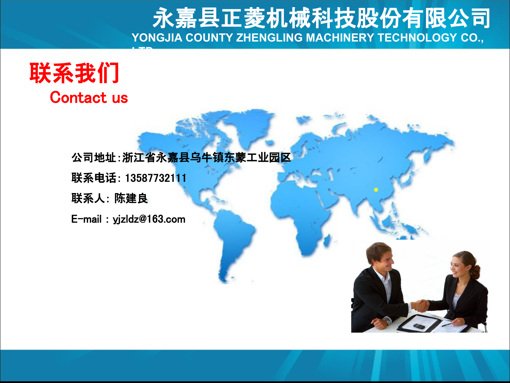

Свяжитесь с нами
Contact us

Адрес: промышленный парк Умэн, пос. Умэн, уезд Юнцзя, пров. Чжэцзян

Тел.: 13587732111
Контактное лицо: Чэнь Цзяньлян

E-mail: yjzldz@163.com

Yongjia County Zhengling Machinery Technology Co., Ltd.
永嘉县正菱机械科技股份有限公司
